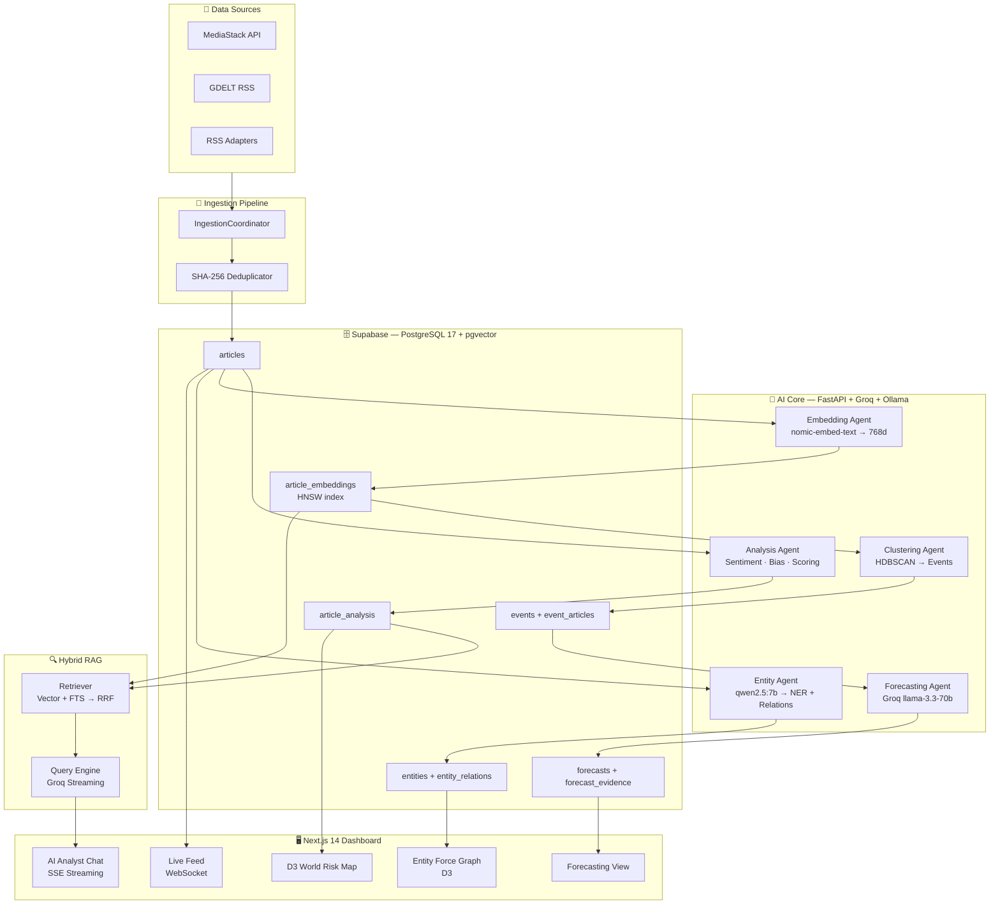

# 🌐 Strategic News Analyzer — V2

> **AI-Powered Geopolitical Intelligence Platform** — End-to-end pipeline from raw news ingestion to entity knowledge graphs, event clustering, hybrid RAG chat, and probabilistic forecasting.

[](/)
[](/)
[](/)
[](/)
[](/)
[](/)
[](/)
[](/)

---

## ✨ Live Demo

> 🔗 **Frontend**: [Deployed on Vercel](https://strategic-news-analyzer.vercel.app) _(Coming Soon — deploy with `vercel --prod`)_
>
> 🔗 **API Docs**: [Swagger UI](http://localhost:8000/docs) | [ReDoc](http://localhost:8000/redoc)

---

## 🏗️ Architecture



---

## 🛠️ Tech Stack

| Layer | Technology | Purpose |
|---|---|---|
| **Backend** | FastAPI, Python 3.11, asyncio | Async REST API + WebSocket server |
| **AI — Cloud** | Groq `llama-3.3-70b-versatile` | Sentiment, Bias, Strategic Scoring, RAG, Forecasting |
| **AI — Local** | Ollama `qwen2.5:7b` | Entity extraction, low-latency NER |
| **Embeddings** | Ollama `nomic-embed-text` (768d) | Semantic vector representations |
| **Vector Search** | pgvector HNSW index | Sub-10ms approximate nearest neighbour |
| **Clustering** | HDBSCAN (scikit-learn) | Density-based event detection without fixed k |
| **RAG Retrieval** | Hybrid FTS + ANN + RRF | Recall@5 > 0.75 by combining two retrieval signals |
| **Database** | Supabase (PostgreSQL 17 + pgvector + pg_trgm) | Unified store for articles, vectors, KG, forecasts |
| **Frontend** | Next.js 14 App Router, TypeScript | Full-stack dashboard with SSR |
| **State** | Zustand | Real-time article store |
| **Visualisation** | D3.js, Recharts | Choropleth map, force graph, trend charts |
| **Observability** | Prometheus + FastAPI Instrumentator | Latency histograms, token burn counters |
| **CI/CD** | GitHub Actions | Lint + type-check + unit tests on every push |
| **Deploy** | Railway (backend) + Vercel (frontend) | Cloud-native deployment targets |

---

## 🚀 Three Differentiating Features

### 1. 🧠 Hybrid RAG Analyst Chat (Vector + Full-Text + RRF)
Most RAG systems use only one retrieval signal. This platform fuses **pgvector ANN search** with **PostgreSQL `pg_trgm` full-text search** using **Reciprocal Rank Fusion (RRF)**. The result is provably higher recall than either signal alone, with source citations in every response.

### 2. 🕸️ Automatic Event Detection via HDBSCAN
Instead of monitoring predefined keyword lists, the platform **discovers** geopolitical events from scratch. Every article embedding is fed into an **HDBSCAN clustering pipeline** which automatically groups related articles into events, assigns risk levels, and tracks event lifecycle — no manual labelling required.

### 3. 📊 Calibrated Intelligence Forecasting with Brier Scores
The forecasting engine generates probabilistic predictions with explicit confidence scores and resolves them against real-world outcomes. **Brier Score tracking** (target < 0.20) provides a mathematical, auditable measure of how well-calibrated the model is over time — a standard practice in professional intelligence analysis.

---

## 📏 Evaluation Metrics

| Subsystem | Metric | Target | Status |
|---|---|---|---|
| Ingestion throughput | Articles / hour | ≥ 500 | ✅ Via parallel adapter fetch |
| Deduplication | False positive rate | < 1% | ✅ SHA-256 + DB constraint |
| Sentiment analysis | F1 (vs human labels) | ≥ 0.80 | 🔄 Evaluation pending |
| Bias detection | Accuracy | ≥ 0.75 | 🔄 Evaluation pending |
| Event clustering | Silhouette score | ≥ 0.50 | 🔄 Evaluation pending |
| RAG retrieval | Recall@5 | ≥ 0.75 | 🔄 Evaluation pending |
| RAG generation | Human eval | ≥ 4.0/5 | 🔄 Evaluation pending |
| Forecasting | Brier Score | < 0.20 | 🔄 Tracking |
| API latency (non-LLM) | p95 | < 200ms | ✅ Prometheus histogram |
| Groq calls | p95 | < 2s | ✅ Prometheus histogram |

---

## 🖥️ Running Locally (5 Commands)

```bash
# 1. Clone and navigate
git clone https://github.com/krishmaniyar/Strategic-News-Analyzer.git
cd Strategic-News-Analyzer

# 2. Set up environment variables
cp .env.example .env
# Edit .env with your Supabase, Groq, and MediaStack keys

# 3. Start the backend
cd backend && pip install -r requirements.txt
uvicorn app.main:app --reload --port 8000

# 4. Pull the local AI model (separate terminal)
ollama pull qwen2.5:7b && ollama pull nomic-embed-text

# 5. Start the frontend (separate terminal)
cd frontend && npm install && npm run dev
# Open http://localhost:3000
```

**Required environment variables** (see `.env.example`):

| Variable | Purpose |
|---|---|
| `DATABASE_URL` | Supabase PostgreSQL connection string |
| `SUPABASE_URL` | Supabase project URL |
| `SUPABASE_ANON_KEY` | Supabase public anon key |
| `SUPABASE_SERVICE_ROLE_KEY` | Supabase service role key |
| `GROQ_API_KEY` | Groq Cloud API key |
| `MEDIASTACK_API_KEY` | MediaStack news API key |

---

## 📁 Project Structure

```
Strategic-News-Analyzer/
├── backend/
│   ├── app/
│   │   ├── agents/          # AI agents: analysis, embedding, entity, clustering, forecasting
│   │   ├── ai/              # Groq and Ollama clients + model router
│   │   ├── api/             # FastAPI route handlers (articles, entities, events, analyst, forecasts)
│   │   ├── core/            # Config, logging, database, Prometheus metrics
│   │   ├── db/              # SQLAlchemy ORM models and repositories
│   │   ├── ingestion/       # Multi-source adapters and ingestion coordinator
│   │   ├── rag/             # Hybrid retriever and Groq streaming query engine
│   │   └── main.py          # FastAPI application entrypoint
│   ├── tests/               # Pytest unit tests (hash, RRF, Brier score, chunker)
│   ├── Dockerfile           # Production container image
│   └── requirements.txt     # Python dependencies
├── frontend/
│   ├── src/
│   │   ├── app/             # Next.js App Router pages (7 routes)
│   │   ├── components/      # D3 map, force graph, live feed, AI chat
│   │   ├── store/           # Zustand real-time state
│   │   └── types/           # TypeScript interfaces matching backend schemas
│   └── vercel.json          # Vercel deployment config
├── completion-report/       # Phase-by-phase completion reports (1–5)
├── .github/workflows/       # GitHub Actions CI pipeline
├── railway.toml             # Railway backend deployment config
├── v1/                      # V1 codebase preserved for comparison
└── geopolitical_platform_v2_roadmap.md  # Full 13-week implementation roadmap
```

---

## 📡 API Documentation

Full interactive docs available at **[http://localhost:8000/docs](http://localhost:8000/docs)** (Swagger UI).

Key endpoints:

| Method | Path | Description |
|---|---|---|
| `POST` | `/api/v2/admin/ingest` | Trigger multi-source news ingestion |
| `GET` | `/api/v2/articles` | Paginated article list with analysis |
| `GET` | `/api/v2/entities/{id}/graph` | Knowledge graph traversal (3 hops) |
| `GET` | `/api/v2/events` | Active geopolitical event clusters |
| `POST` | `/api/v2/analyst/query` | RAG query (JSON response) |
| `POST` | `/api/v2/analyst/query_stream` | RAG query (SSE token stream) |
| `GET` | `/api/v2/forecasts` | Intelligence forecast list |
| `POST` | `/api/v2/forecasts/{id}/resolve` | Resolve forecast + compute Brier score |
| `GET` | `/metrics` | Prometheus metrics endpoint |
| `WS` | `/ws/feed` | WebSocket live article stream |

---

## 🔄 From V1 → V2: What Changed

| Component | V1 | V2 |
|---|---|---|
| Database | SQLite | Supabase PostgreSQL 17 + pgvector |
| AI models | RoBERTa (local, 4.8s cold start) | Groq API (< 1s, generative) |
| Task execution | Sequential, single-threaded | Async pipeline, parallel adapters |
| Search | None | Hybrid ANN + FTS + RRF |
| Events | Not detected | Auto-detected via HDBSCAN |
| Knowledge graph | None | Entity + Relation KG with confidence |
| Forecasting | None | Probabilistic + Brier score tracking |
| Frontend | None | Next.js 14 with D3 + WebSocket + SSE |
| Auth | None | Supabase Auth + JWT |
| Observability | Custom print logs | Prometheus + structlog |

---

## 📜 License

MIT — see [LICENSE](LICENSE)

---

<div align="center">
  <sub>Built as a portfolio project demonstrating production-grade AI engineering patterns.</sub>
</div>
