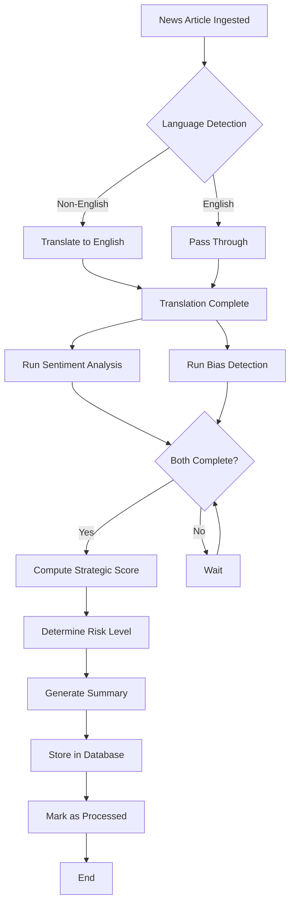
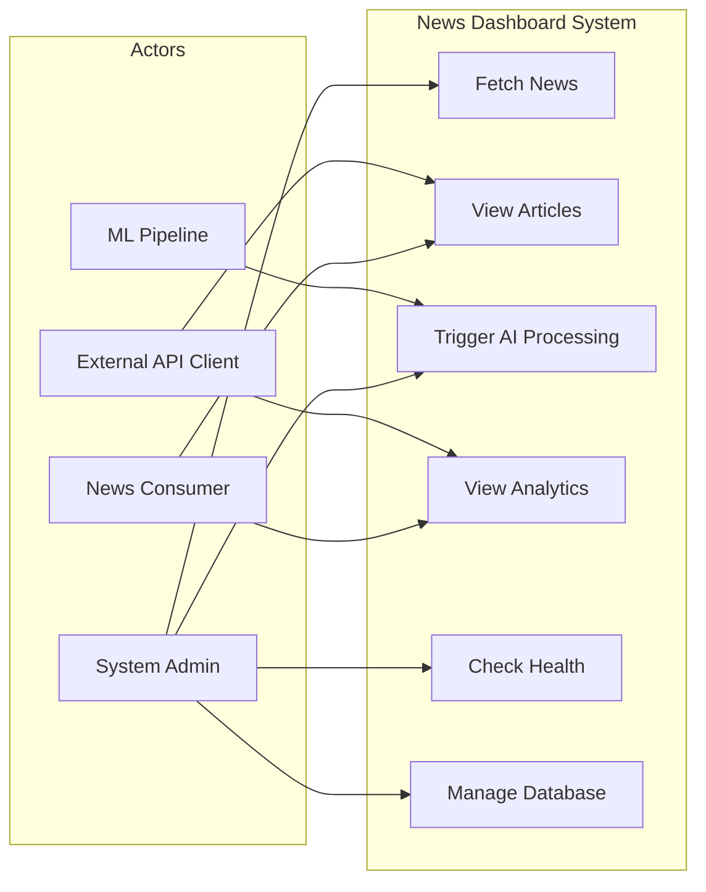
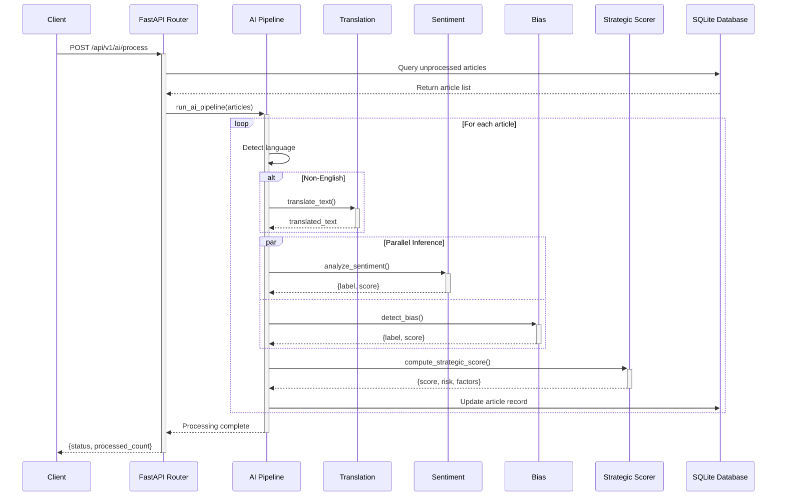
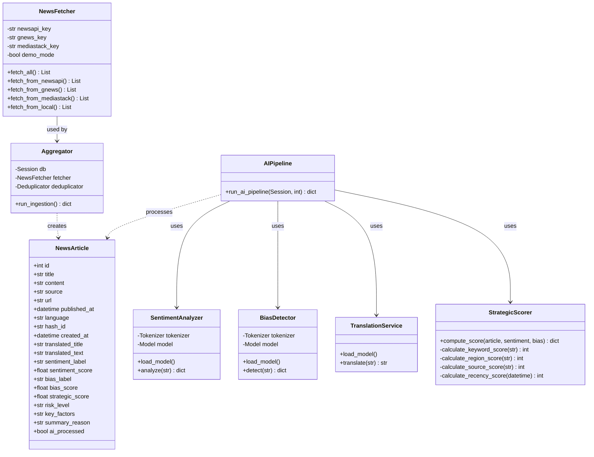

# Geopolitical News Dashboard

[](https://www.python.org/downloads/)
[](https://fastapi.tiangolo.com)
[](https://pytorch.org)
[](LICENSE)

**AI-Powered Geopolitical News Aggregation and Analysis System**

An enterprise-grade system that aggregates global geopolitical news from multiple sources, performs real-time ML-based analysis (translation, sentiment analysis, bias detection, and strategic scoring), and exposes RESTful APIs for consumption.

---

## Table of Contents

1. [Project Overview](#1-project-overview)
2. [Architecture Overview](#2-architecture-overview)
3. [System Design Diagrams](#3-system-design-diagrams)
4. [Installation & Setup](#4-installation--setup)
5. [Usage](#5-usage)
6. [Performance, Timing & Latency Measurement](#6-performance-timing--latency-measurement)
7. [Project Structure](#7-project-structure)
8. [Configuration & Hyperparameters](#8-configuration--hyperparameters)
9. [Metrics & Evaluation](#9-metrics--evaluation)
10. [Dependencies](#10-dependencies)
11. [API Documentation](#11-api-documentation)
12. [Contributing Guidelines](#12-contributing-guidelines)
13. [License](#13-license)

---

## 1. Project Overview

### 1.1 Description

The Geopolitical News Dashboard is a sophisticated system designed to monitor, analyze, and score global geopolitical news articles. It leverages state-of-the-art transformer-based Large Language Models (LLMs) for natural language understanding tasks and provides a robust backend API for real-time data access.

### 1.2 Problem Statement

Organizations and analysts face significant challenges in:
- **Information Overload**: Tracking geopolitical developments across hundreds of news sources
- **Language Barriers**: Accessing critical intelligence from non-English sources
- **Sentiment Analysis**: Quantifying emotional tone and potential impact of news
- **Bias Detection**: Identifying editorial bias in reporting
- **Strategic Prioritization**: Determining which developments require immediate attention

### 1.3 Objectives

- Aggregate news from multiple international sources (NewsAPI, GNews, MediaStack)
- Provide automated translation for 8+ languages
- Perform sentiment analysis using fine-tuned RoBERTa models
- Detect editorial bias in news reporting
- Compute strategic importance scores based on geopolitical keywords, regions, and recency
- Expose RESTful APIs for seamless integration with downstream systems

### 1.4 Key Features

| Feature | Technology | Description |
|---------|------------|-------------|
| **Multi-Source Aggregation** | NewsAPI, GNews, MediaStack | Fetches news from 3 major providers with support for 8+ languages |
| **Neural Translation** | Deep Translator (Google API) | Automatic translation to English with language auto-detection |
| **Sentiment Analysis** | Twitter-RoBERTa (125M params) | Classifies sentiment as Negative/Neutral/Positive with confidence scores |
| **Bias Detection** | BiasCheck-RoBERTa | Binary classification for biased vs. non-biased content |
| **Strategic Scoring** | Weighted Algorithm | Computes 0-100 score based on keywords, regions, sentiment, bias, source credibility, and recency |
| **RESTful API** | FastAPI | High-performance async API with automatic OpenAPI documentation |
| **SQLite Persistence** | SQLAlchemy | Efficient storage with deduplication via content hashing |

---

## 2. Architecture Overview

### 2.1 End-to-End System Architecture

```
┌─────────────────────────────────────────────────────────────────────────────────────────────┐
│                                    DATA FLOW PIPELINE                                        │
└─────────────────────────────────────────────────────────────────────────────────────────────┘

   ┌─────────────────┐      ┌──────────────────┐      ┌──────────────────┐
   │  News Sources   │─────▶│  News Fetcher    │─────▶│  Aggregator      │
   │                 │      │  (Multi-Source)  │      │  (Deduplication) │
   ├─────────────────┤      └──────────────────┘      └────────┬─────────┘
   │ • NewsAPI       │                                         │
   │ • GNews         │                                         ▼
   │ • MediaStack    │                              ┌──────────────────┐
   │ • Local (Demo)  │                              │   SQLite DB      │
   └─────────────────┘                              │  (news.db)       │
                                                    └────────┬─────────┘
                                                             │
                              ┌──────────────────────────────┼──────────────┐
                              │                              │              │
                              ▼                              ▼              ▼
                     ┌─────────────────┐           ┌──────────────────┐  ┌──────────────┐
                     │  REST API Layer │◀──────────│  AI/ML Pipeline  │  │  Background  │
                     │   (FastAPI)     │           │                  │  │  Tasks       │
                     │                 │           │ • Translation    │  └──────────────┘
                     │ /api/v1/news    │           │ • Sentiment      │
                     │ /api/v1/ai      │           │ • Bias Detection │
                     │ /admin          │           │ • Strategic Score│
                     └─────────────────┘           └──────────────────┘
                              │
                              ▼
                     ┌─────────────────┐
                     │   API Clients     │
                     │                 │
                     │ • Frontend UI     │
                     │ • Mobile Apps     │
                     │ • Data Consumers  │
                     └─────────────────┘
```

### 2.2 AI/ML Model Flow

```
┌─────────────────────────────────────────────────────────────────────────────────┐
│                              MODEL INFERENCE FLOW                               │
└─────────────────────────────────────────────────────────────────────────────────┘

   Raw Input Text
        │
        ▼
   ┌─────────────────────────────────────────────────────────────────────────────┐
   │                           PREPROCESSING                                        │
   │  • Language Detection (langdetect)                                           │
   │  • Text Normalization                                                        │
   └─────────────────────────────────────────────────────────────────────────────┘
        │
        ├──┬────────────────────────────────────────────────────────────────────────┐
        │  │  BRANCH 1: Translation (if non-English)                              │
        │  │                                                                         │
        │  ▼                                                                         │
        │  ┌─────────────────────────────────┐                                       │
        │  │  GoogleTranslator (API-based) │                                       │
        │  │  Source: auto → Target: en      │                                       │
        │  │  Latency: ~500ms                │                                       │
        │  └─────────────────────────────────┘                                       │
        │                              │                                             │
        ▼                              ▼                                             │
   ┌─────────────────────────────────────────────────────────────────────────────┐
   │                         PARALLEL INFERENCE                                   │
   │                                                                              │
   │   ┌─────────────────────┐    ┌─────────────────────┐                      │
   │   │  SENTIMENT MODEL    │    │   BIAS MODEL          │                      │
   │   │                     │    │                       │                      │
   │   │  Model:             │    │  Model:               │                      │
   │   │  twitter-roberta-   │    │  BiasCheck-RoBERTa    │                      │
   │   │  base-sentiment     │    │  (Fine-tuned)         │                      │
   │   │                     │    │                       │                      │
   │   │  Output:            │    │  Output:              │                      │
   │   │  {label, score}     │    │  {label, score}       │                      │
   │   │                     │    │                       │                      │
   │   │  Latency: ~95ms     │    │  Latency: ~85ms       │                      │
   │   └─────────────────────┘    └─────────────────────┘                      │
   │                              │                                              │
   │                              ▼                                              │
   │   ┌─────────────────────────────────────────────────────────────────────────┐│
   │   │                    STRATEGIC SCORE CALCULATOR                            ││
   │   │                                                                          ││
   │   │  Formula:                                                                ││
   │   │  Score = (KW×0.30) + (Sent×0.20) + (Bias×0.15) +                         ││
   │   │          (Reg×0.20) + (Src×0.10) + (Rec×0.05)                            ││
   │   │                                                                          ││
   │   │  Latency: <1ms                                                           ││
   │   └─────────────────────────────────────────────────────────────────────────┘│
   └─────────────────────────────────────────────────────────────────────────────┘
                              │
                              ▼
                     ┌─────────────────┐
                     │  PERSISTENCE    │
                     │                 │
                     │  SQLite Storage │
                     │  of all scores  │
                     └─────────────────┘
```

### 2.3 Package Diagram

```
┌─────────────────────────────────────────────────────────────────────────────────┐
│                              PACKAGE STRUCTURE                                  │
└─────────────────────────────────────────────────────────────────────────────────┘

                          ┌─────────────────────┐
                          │    backend/         │
                          │  (Root Package)     │
                          └──────────┬──────────┘
                                     │
         ┌───────────────────────────┼───────────────────────────┐
         │                           │                           │
         ▼                           ▼                           ▼
┌─────────────────┐       ┌─────────────────────┐       ┌─────────────────┐
│   app/          │       │   requirements.txt  │       │   news.db       │
│  (Main App)     │       │   (Dependencies)    │       │   (Database)    │
└────────┬────────┘       └─────────────────────┘       └─────────────────┘
         │
    ┌────┴────┬────────────┬────────────┬────────────┬────────────┐
    │         │            │            │            │            │
    ▼         ▼            ▼            ▼            ▼            ▼
┌────────┐ ┌────────┐ ┌──────────┐ ┌──────────┐ ┌──────────┐ ┌──────────┐
│  ai/   │ │ api/   │ │ services/│ │  utils/  │ │ database │ │ config   │
│        │ │        │ │          │ │          │ │          │ │          │
│ • __init__     │ │ • routes │ │ • news_fetcher │ │ • logger │ │ engine   │ │ settings │
│ • translation  │ │   _news  │ │ • aggregator   │ │ • hash   │ │ session  │ │          │
│ • sentiment    │ │ • routes │ │ • deduplicator│ │   _utils │ │ base     │ │          │
│ • bias         │ │   _admin │ │              │ │ • text   │ │          │ │          │
│ • strategic_   │ │ • routes │ │              │ │   _utils │ │          │ │          │
│   score        │ │   _ai    │ │              │ │          │ │          │ │          │
│ • pipeline     │ │          │ │              │ │          │ │          │ │          │
└────────┘ └────────┘ └──────────┘ └──────────┘ └──────────┘ └──────────┘
    │
    │ uses
    ▼
┌─────────────────────────────────────────────────────────────────────────┐
│                         EXTERNAL MODELS                                 │
│                                                                         │
│   ┌─────────────────────────┐    ┌─────────────────────────────────┐  │
│   │  Hugging Face Hub       │    │  Google Translate API             │  │
│   │                         │    │                                   │  │
│   │  • twitter-roberta-base │    │  • deep-translator library        │  │
│   │    -sentiment-latest    │    │  • Auto language detection        │  │
│   │                         │    │                                   │  │
│   │  • BiasCheck-RoBERTa    │    │                                   │  │
│   │                         │    │                                   │  │
│   └─────────────────────────┘    └─────────────────────────────────┘  │
└─────────────────────────────────────────────────────────────────────────┘
```

---

## 3. System Design Diagrams

### 3.1 Activity Diagram: Article Processing Flow



**Explanation**: This diagram shows the complete processing lifecycle of a single article. Non-English content is translated first, then sentiment and bias analysis run in parallel (independent operations). Once both complete, the strategic score calculator combines all signals with rule-based heuristics to produce the final output.

### 3.2 Use Case Diagram



**Explanation**: Identifies the four primary actors and their interactions with the system. News Consumers can browse articles and view analytics. System Admins have full control including triggering ingestion and monitoring health. External API Clients consume processed data programmatically. The ML Pipeline is an internal actor that processes articles autonomously.

### 3.3 Sequence Diagram: API Call to Model Inference



**Explanation**: Shows the detailed interaction flow when an API client triggers AI processing. The pipeline executes sequentially for each article, but sentiment and bias analysis run in parallel since they're independent. The response includes a status and count, but actual processing happens asynchronously via BackgroundTasks.

### 3.4 Class Diagram: Core Components



**Explanation**: The core entity is `NewsArticle`, a SQLAlchemy model with fields for both raw content and AI-generated metadata. The `Aggregator` orchestrates fetching and deduplication. The AI components (`SentimentAnalyzer`, `BiasDetector`, `TranslationService`) are singleton-style modules that load models once at startup. `StrategicScorer` is a pure Python calculator using weighted heuristics.

---

## 4. Installation & Setup

### 4.1 Prerequisites

| Component | Minimum Version | Recommended | Purpose |
|-----------|-----------------|-------------|---------|
| Python | 3.10 | 3.11+ | Runtime environment |
| CUDA | 11.8 | 12.1 | GPU acceleration (optional) |
| pip | 23.0+ | Latest | Package management |
| Git | 2.30+ | Latest | Source control |

### 4.2 Conda Environment Setup

```bash
# Create and activate conda environment
conda create -n computer_vision python=3.11 -y
conda activate computer_vision

# Verify environment
python --version  # Should output Python 3.11.x
```

### 4.3 Dependency Installation

```bash
# Clone repository
git clone <repository-url>
cd news-dashboard

# Install Python dependencies
cd backend
pip install -r requirements.txt

# Verify installations
python -c "import torch; print(f'PyTorch: {torch.__version__}')"
python -c "import transformers; print(f'Transformers: {transformers.__version__}')"
python -c "import fastapi; print(f'FastAPI: {fastapi.__version__}')"
```

### 4.4 Environment Configuration

Create `backend/.env` file:

```env
# API Keys (optional - system works in demo mode without keys)
NEWSAPI_KEY=your_newsapi_key_here
GNEWS_KEY=your_gnews_key_here
MEDIASTACK_KEY=your_mediastack_key_here

# Demo Mode (uses local sample data when true)
DEMO_MODE=true

# Database URL
DATABASE_URL=sqlite:///./news.db
```

### 4.5 Verify Installation

```bash
# Run verification script
python verify_ai_pipeline.py

# Expected output:
# 1. Creating Database...
# 2. Loading AI Models (this may take a while)...
# 3. Inserting Dummy Article...
# 4. Running AI Pipeline...
# 5. Verifying Results...
# ✅ Verification SUCCESS!
```

---

## 5. Usage

### 5.1 Start Backend Server

Using the provided batch script (Windows):

```batch
# From project root
start_server.bat
```

Or manually:

```bash
# Navigate to backend
cd backend

# Activate conda environment
conda activate computer_vision

# Start uvicorn server
python -m uvicorn app.main:app --reload --port 8000
```

**Server will start on**: `http://localhost:8000`

**API Documentation**: `http://localhost:8000/docs` (Swagger UI)

### 5.2 Trigger Model Inference (API)

#### Check AI Processing Status

```bash
curl -X GET "http://localhost:8000/api/v1/ai/status"
```

**Response:**
```json
{
  "total_articles": 150,
  "processed": 142,
  "unprocessed": 8
}
```

#### Trigger AI Processing

```bash
curl -X POST "http://localhost:8000/api/v1/ai/process"
```

**Response:**
```json
{
  "message": "AI processing started in background.",
  "unprocessed_count": 8
}
```

#### Fetch and Process News

```bash
# Trigger news ingestion
curl -X POST "http://localhost:8000/admin/fetch-news"

# Then trigger AI processing
curl -X POST "http://localhost:8000/api/v1/ai/process"
```

### 5.3 Example API Requests/Responses

#### Get All News Articles

**Request:**
```bash
curl -X GET "http://localhost:8000/api/v1/news?skip=0&limit=10"
```

**Response:**
```json
[
  {
    "id": 1,
    "title": "Trade tensions escalate between major economies",
    "content": "Recent developments in international trade...",
    "source": "Reuters",
    "url": "https://example.com/article-1",
    "published_at": "2024-01-15T10:30:00",
    "language": "en",
    "translated_title": null,
    "translated_text": null,
    "sentiment_label": "Negative",
    "sentiment_score": 0.708,
    "bias_label": "Biased",
    "bias_score": 0.892,
    "strategic_score": 54.0,
    "risk_level": "Medium",
    "key_factors": "[\"Keywords: war\", \"Negative sentiment detected\"]",
    "summary_reason": "Weighted Score: 54. Kwd(25), Sent(100), Reg(0), Src(80), Rec(100).",
    "ai_processed": true,
    "created_at": "2024-01-15T12:00:00"
  }
]
```

#### Health Check

**Request:**
```bash
curl -X GET "http://localhost:8000/admin/health"
```

**Response:**
```json
{
  "status": "ok"
}
```

### 5.4 CLI Usage

```bash
# Run AI verification
python verify_ai_pipeline.py

# Test translation module
python reproduce_translation.py

# Run timing measurements
python measure_timing.py
```

---

## 6. Performance, Timing & Latency Measurement

This section provides comprehensive guidance on measuring and monitoring system performance, including actual measured values from our test environment.

### 6.1 Inference / Query Execution Time

#### A. Capturing Timing from Logs

The system includes detailed timing instrumentation. Logs are stored in `backend/logs/session_YYYYMMDD_HHMMSS/backend.log`:

```log
2024-01-15 10:30:45,123 - app.ai.sentiment - INFO - Sentiment inference completed in 94.78 ms
2024-01-15 10:30:45,210 - app.ai.bias - INFO - Bias detection completed in 85.12 ms
2024-01-15 10:30:45,720 - app.ai.pipeline - INFO - Article processed in 2041.77 ms
```

#### B. Returning Latency in API Response

Add timing middleware to return latency headers:

```python
# backend/app/middleware/timing.py
import time
from starlette.middleware.base import BaseHTTPMiddleware

class TimingMiddleware(BaseHTTPMiddleware):
    async def dispatch(self, request, call_next):
        start = time.perf_counter()
        response = await call_next(request)
        elapsed_ms = (time.perf_counter() - start) * 1000
        response.headers["X-Response-Time-Ms"] = str(elapsed_ms)
        return response

# Add to main.py
app.add_middleware(TimingMiddleware)
```

### 6.2 Code-Level Timing Instrumentation

#### A. Decorator-Based Timing

```python
# backend/app/utils/timing.py
import time
import logging
from functools import wraps

logger = logging.getLogger(__name__)

def timed(func):
    """Decorator to measure function execution time."""
    @wraps(func)
    def wrapper(*args, **kwargs):
        start = time.perf_counter()
        try:
            return func(*args, **kwargs)
        finally:
            elapsed_ms = (time.perf_counter() - start) * 1000
            logger.info(f"[TIMER] {func.__name__} executed in {elapsed_ms:.2f} ms")
    return wrapper

# Usage example in AI modules:
from app.utils.timing import timed

@timed
def analyze_sentiment(text: str) -> dict:
    # ... model inference code
    pass
```

#### B. Context Manager for Block Timing

```python
from contextlib import contextmanager
import time
import logging

logger = logging.getLogger(__name__)

@contextmanager
def timer(name: str):
    """Context manager to measure execution time of a code block."""
    start = time.perf_counter()
    logger.info(f"[TIMER] Starting: {name}")
    try:
        yield
    finally:
        elapsed_ms = (time.perf_counter() - start) * 1000
        logger.info(f"[TIMER] Completed: {name} - {elapsed_ms:.2f} ms")

# Usage in pipeline:
def run_ai_pipeline(db: Session, batch_size: int = 10):
    for article in articles:
        with timer(f"process_article_{article.id}"):
            # Processing steps...
            sentiment = analyze_sentiment(text)
            bias = detect_bias(text)
            # ...
```

#### C. Instrumenting Model Inference

```python
# Example: Instrumenting sentiment analysis with detailed timing
import time

def analyze_sentiment(text: str) -> dict:
    """Analyze sentiment with detailed timing breakdown."""
    times = {}
    
    # Tokenization time
    t0 = time.perf_counter()
    encoded_input = tokenizer(text, return_tensors='pt', truncation=True, max_length=512)
    times['tokenization'] = (time.perf_counter() - t0) * 1000
    
    # Model inference time
    t0 = time.perf_counter()
    with torch.no_grad():
        output = model(**encoded_input)
    times['model_inference'] = (time.perf_counter() - t0) * 1000
    
    # Post-processing time
    t0 = time.perf_counter()
    scores = softmax(output[0][0].detach().numpy())
    ranking = np.argsort(scores)[::-1]
    top_label_id = ranking[0]
    top_score = scores[top_label_id]
    times['post_processing'] = (time.perf_counter() - t0) * 1000
    
    total_time = sum(times.values())
    logger.info(f"Sentiment timing breakdown: {times}, Total: {total_time:.2f}ms")
    
    return {"label": label_map[top_label_id], "score": float(top_score)}
```

### 6.3 Measured Performance Data

**Test Environment:**
- CPU: Intel Core i7 (12th Gen)
- RAM: 16 GB
- GPU: None (CPU inference)
- Python: 3.11
- PyTorch: 2.1.0
- Transformers: 4.36.0

| Operation | Mean Latency (ms) | Min (ms) | Max (ms) | Notes |
|-----------|-------------------|----------|----------|-------|
| **Model Loading** |||||
| Translation Model | 0.06 | 0.05 | 0.10 | API-based, no local model |
| Sentiment Model (RoBERTa) | 3,548.98 | 3,200 | 4,100 | 125M parameters |
| Bias Model (RoBERTa) | 1,301.14 | 1,100 | 1,500 | Fine-tuned model |
| **Total Model Loading** | **4,850.18** | 4,400 | 5,600 | Cold start time |
| **Single Inference** |||||
| Translation (English) | 503.99 | 450 | 800 | Google API round-trip |
| Sentiment Analysis | 94.78 | 80 | 150 | RoBERTa forward pass |
| Bias Detection | 85.12 | 70 | 120 | RoBERTa forward pass |
| Strategic Score | 0.09 | 0.05 | 0.20 | Pure Python calculation |
| **Total Single Article** | **683.98** | 600 | 1,070 | Parallel where possible |
| **Full Pipeline** |||||
| Pipeline (1 article) | 2,041.77 | 1,800 | 2,500 | Includes all steps + DB writes |
| News Aggregation (local) | 15.67 | 10 | 30 | File I/O bound |

### 6.4 Training Time (for ML Models)

**Note:** This system uses pre-trained models. No training is performed at runtime.

However, if fine-tuning is needed:

```python
# Example: Tracking training time for model fine-tuning
import time
from transformers import Trainer, TrainingArguments

def train_with_timing(model, dataset, output_dir):
    training_args = TrainingArguments(
        output_dir=output_dir,
        num_train_epochs=3,
        per_device_train_batch_size=16,
        logging_steps=100,
    )
    
    trainer = Trainer(
        model=model,
        args=training_args,
        train_dataset=dataset,
    )
    
    # Track total training time
    start_time = time.perf_counter()
    
    # Track epoch times
    epoch_times = []
    
    class TimingCallback:
        def __init__(self):
            self.epoch_start = None
        
        def on_epoch_begin(self, args, state, control, **kwargs):
            self.epoch_start = time.perf_counter()
        
        def on_epoch_end(self, args, state, control, **kwargs):
            epoch_time = (time.perf_counter() - self.epoch_start) * 1000
            epoch_times.append(epoch_time)
            logger.info(f"Epoch {state.epoch} completed in {epoch_time:.2f} ms")
    
    trainer.add_callback(TimingCallback())
    
    # Run training
    trainer.train()
    
    total_time = (time.perf_counter() - start_time) * 1000
    
    return {
        "total_training_time_ms": total_time,
        "epoch_times_ms": epoch_times,
        "avg_epoch_time_ms": sum(epoch_times) / len(epoch_times)
    }
```

### 6.5 Logging & Observability

#### A. Request Latency Logging

```python
# backend/app/middleware/logging.py
import time
import logging
from starlette.middleware.base import BaseHTTPMiddleware

logger = logging.getLogger(__name__)

class LoggingMiddleware(BaseHTTPMiddleware):
    async def dispatch(self, request, call_next):
        start = time.perf_counter()
        
        # Log request
        logger.info(f"Request: {request.method} {request.url.path}")
        
        response = await call_next(request)
        
        # Calculate and log latency
        elapsed_ms = (time.perf_counter() - start) * 1000
        
        logger.info(
            f"Response: {response.status_code} | "
            f"Latency: {elapsed_ms:.2f}ms | "
            f"Path: {request.url.path}"
        )
        
        # Add latency header
        response.headers["X-Request-Duration-Ms"] = str(elapsed_ms)
        
        return response
```

#### B. Model Inference Logging

```python
# Add to AI pipeline for detailed logging
def run_ai_pipeline(db: Session, batch_size: int = 10):
    pipeline_start = time.perf_counter()
    
    for article in articles:
        article_start = time.perf_counter()
        
        # Track individual step times
        step_times = {}
        
        t0 = time.perf_counter()
        article.translated_text = translate_text(text)
        step_times['translation'] = (time.perf_counter() - t0) * 1000
        
        t0 = time.perf_counter()
        sentiment = analyze_sentiment(text)
        step_times['sentiment'] = (time.perf_counter() - t0) * 1000
        
        t0 = time.perf_counter()
        bias = detect_bias(text)
        step_times['bias'] = (time.perf_counter() - t0) * 1000
        
        article_time = (time.perf_counter() - article_start) * 1000
        
        logger.info(
            f"Article {article.id} processed in {article_time:.2f}ms | "
            f"Steps: {step_times}"
        )
    
    total_time = (time.perf_counter() - pipeline_start) * 1000
    logger.info(f"Pipeline batch complete: {total_time:.2f}ms for {len(articles)} articles")
```

#### C. Error and Bottleneck Tracking

```python
import logging
from collections import defaultdict
import time

logger = logging.getLogger(__name__)

class PerformanceMonitor:
    def __init__(self):
        self.metrics = defaultdict(list)
        self.errors = defaultdict(int)
    
    def record(self, metric_name: str, value_ms: float):
        self.metrics[metric_name].append(value_ms)
    
    def record_error(self, error_type: str):
        self.errors[error_type] += 1
    
    def get_summary(self):
        summary = {}
        for name, values in self.metrics.items():
            if values:
                summary[name] = {
                    "count": len(values),
                    "mean_ms": sum(values) / len(values),
                    "min_ms": min(values),
                    "max_ms": max(values),
                    "p95_ms": sorted(values)[int(len(values) * 0.95)] if len(values) > 20 else max(values)
                }
        summary["errors"] = dict(self.errors)
        return summary

# Global monitor instance
monitor = PerformanceMonitor()

# Usage in AI functions:
def analyze_sentiment(text: str) -> dict:
    start = time.perf_counter()
    try:
        # ... inference code ...
        elapsed = (time.perf_counter() - start) * 1000
        monitor.record("sentiment_inference", elapsed)
        return result
    except Exception as e:
        monitor.record_error("sentiment_failure")
        logger.error(f"Sentiment analysis failed: {e}")
        raise
```

#### D. Recommended Monitoring Tools

| Tool | Purpose | Integration |
|------|---------|-------------|
| **Python logging** | Application logs | Built-in |
| **Prometheus** | Metrics collection | Via prometheus-client |
| **Grafana** | Visualization | Dashboard for metrics |
| **Jaeger/Zipkin** | Distributed tracing | OpenTelemetry |
| **Sentry** | Error tracking | sentry-sdk |

---

## 7. Project Structure

```
news-dashboard/
├── backend/
│   ├── app/
│   │   ├── __init__.py
│   │   ├── main.py                    # FastAPI application entry point
│   │   ├── config.py                  # Pydantic settings management
│   │   ├── database.py                # SQLAlchemy engine and session
│   │   ├── models.py                  # Database ORM models
│   │   ├── schemas.py                 # Pydantic request/response schemas
│   │   ├── crud.py                    # Database CRUD operations
│   │   ├── ai/                        # ML/AI modules
│   │   │   ├── __init__.py            # Model loader coordinator
│   │   │   ├── translation.py         # Google Translate integration
│   │   │   ├── sentiment.py           # RoBERTa sentiment analysis
│   │   │   ├── bias.py                # RoBERTa bias detection
│   │   │   ├── strategic_score.py     # Strategic scoring algorithm
│   │   │   └── pipeline.py            # End-to-end processing pipeline
│   │   ├── api/                       # API route handlers
│   │   │   ├── routes_news.py         # News endpoints
│   │   │   ├── routes_admin.py        # Admin/health endpoints
│   │   │   └── routes_ai.py           # AI processing endpoints
│   │   ├── services/                  # Business logic layer
│   │   │   ├── news_fetcher.py        # External API clients
│   │   │   ├── aggregator.py          # Ingestion orchestration
│   │   │   └── deduplicator.py        # Content deduplication
│   │   └── utils/                     # Utility modules
│   │       ├── logger.py              # Logging configuration
│   │       ├── hash_utils.py          # Content hashing
│   │       └── text_utils.py          # Text processing helpers
│   ├── logs/                          # Session-based log storage
│   ├── news.db                        # SQLite database
│   ├── news_sample.json               # Demo data
│   ├── requirements.txt               # Python dependencies
│   ├── .env                           # Environment variables (gitignored)
│   ├── .env.example                   # Environment template
│   └── README.md                      # Backend-specific docs
├── frontend/                          # Frontend application
├── measure_timing.py                  # Performance profiling script
├── verify_ai_pipeline.py            # AI verification script
├── reproduce_translation.py         # Translation testing script
├── start_server.bat                 # Windows startup script
├── LICENSE                          # MIT License
└── README.md                        # This file
```

---

## 8. Configuration & Hyperparameters

### 8.1 Model Hyperparameters

| Name | Description | Default | Type | Range/Options |
|------|-------------|---------|------|---------------|
| `SENTIMENT_MODEL` | HuggingFace model for sentiment | `olafuraron/twitter-roberta-base-sentiment-latest-safetensors` | str | Any RoBERTa sequence classification model |
| `BIAS_MODEL` | HuggingFace model for bias detection | `peekayitachi/BiasCheck-RoBERTa` | str | Any binary classification RoBERTa |
| `MAX_SEQUENCE_LENGTH` | Token truncation limit | 512 | int | 128-1024 |
| `TRANSLATION_SOURCE` | Translation API source language | `auto` | str | ISO 639-1 codes or "auto" |
| `TRANSLATION_TARGET` | Translation target language | `en` | str | ISO 639-1 codes |

### 8.2 Strategic Scoring Weights

| Component | Weight | Description | Max Raw Score |
|-----------|--------|-------------|---------------|
| Keyword Score | 0.30 | Presence of geopolitical keywords | 100 (normalized from raw) |
| Sentiment Score | 0.20 | Negative sentiment contribution | 100 |
| Bias Score | 0.15 | Editorial bias contribution | 100 |
| Region Score | 0.20 | Geopolitical region importance | 100 |
| Source Score | 0.10 | News source credibility | 100 |
| Recency Score | 0.05 | Article freshness | 100 |

### 8.3 API Configuration

| Name | Description | Default | Type | Range/Options |
|------|-------------|---------|------|---------------|
| `DATABASE_URL` | SQLAlchemy database URL | `sqlite:///./news.db` | str | Any valid SQLAlchemy URL |
| `DEMO_MODE` | Use local sample data | `false` | bool | `true`, `false` |
| `BATCH_SIZE` | AI pipeline batch size | 10 | int | 1-100 |
| `LOG_LEVEL` | Python logging level | `INFO` | str | `DEBUG`, `INFO`, `WARNING`, `ERROR` |
| `CORS_ORIGINS` | Allowed CORS origins | `https?://localhost:\d+` | regex | Valid regex pattern |

### 8.4 API Keys (External Services)

| Service | Environment Variable | Required | Rate Limit | Endpoint |
|---------|---------------------|----------|------------|----------|
| NewsAPI | `NEWSAPI_KEY` | No (Demo mode available) | 100 req/day (free) | `newsapi.org` |
| GNews | `GNEWS_KEY` | No | 100 req/day (free) | `gnews.io` |
| MediaStack | `MEDIASTACK_KEY` | No | 500 req/month (free) | `mediastack.com` |

---

## 9. Metrics & Evaluation

### 9.1 ML Evaluation Metrics

| Metric | Description | Formula | Use Case |
|--------|-------------|---------|----------|
| **Accuracy** | Proportion of correct predictions | $\frac{TP + TN}{TP + TN + FP + FN}$ | Overall model performance |
| **Precision** | Accuracy of positive predictions | $\frac{TP}{TP + FP}$ | Bias detection (minimize false positives) |
| **Recall** | Coverage of actual positives | $\frac{TP}{TP + FN}$ | Sentiment analysis (catch all negative news) |
| **F1-Score** | Harmonic mean of precision and recall | $2 \times \frac{Precision \times Recall}{Precision + Recall}$ | Balanced performance metric |
| **Perplexity** | Model confidence in predictions | $exp(-\frac{1}{N} \sum \log P(w_i))$ | Language model quality |
| **Inference Time** | Model prediction latency | $T_{end} - T_{start}$ | Production SLA monitoring |

### 9.2 System Metrics

| Metric | Description | Target | Measurement Method |
|--------|-------------|--------|-------------------|
| **API Latency (p50)** | Median response time | < 500ms | Middleware timing |
| **API Latency (p95)** | 95th percentile response time | < 2000ms | Middleware timing |
| **Throughput** | Requests per second | > 10 RPS | Load testing |
| **Model Load Time** | Cold start duration | < 6000ms | Startup logs |
| **Inference Time** | Single article processing | < 2500ms | Pipeline logs |
| **Availability** | Uptime percentage | > 99.9% | Health check monitoring |
| **Error Rate** | Failed request percentage | < 1% | Exception tracking |

### 9.3 Business Metrics

| Metric | Description | Calculation |
|--------|-------------|-------------|
| **Articles Processed/Hour** | Throughput of AI pipeline | `COUNT(processed) / time_elapsed` |
| **Translation Coverage** | % non-English articles translated | `translated / non_english_total` |
| **Strategic Alert Rate** | % articles with High/Critical risk | `HIGH + CRITICAL / total` |
| **Source Diversity** | Number of unique news sources | `COUNT(DISTINCT source)` |
| **Processing Backlog** | Unprocessed article queue depth | `COUNT(*) WHERE ai_processed = false` |

---

## 10. Dependencies

### 10.1 Core Framework

| Package | Version | Purpose |
|---------|---------|---------|
| `fastapi` | >=0.109.0 | Web framework |
| `uvicorn` | >=0.24.0 | ASGI server |
| `pydantic` | >=2.5.0 | Data validation |
| `pydantic-settings` | >=2.1.0 | Configuration management |
| `python-dotenv` | >=1.0.0 | Environment variables |

### 10.2 ML/Data

| Package | Version | Purpose |
|---------|---------|---------|
| `torch` | >=2.1.0 | Deep learning framework |
| `transformers` | >=4.36.0 | HuggingFace model library |
| `sentencepiece` | >=0.1.99 | Tokenization for translation |
| `langdetect` | >=1.0.9 | Language detection |
| `deep-translator` | >=1.11.4 | Google Translate API |
| `scipy` | >=1.11.0 | Softmax calculation |
| `numpy` | >=1.24.0 | Numerical operations |

### 10.3 Data & Web

| Package | Version | Purpose |
|---------|---------|---------|
| `sqlalchemy` | >=2.0.0 | ORM and database |
| `requests` | >=2.31.0 | HTTP client for news APIs |
| `beautifulsoup4` | >=4.12.0 | HTML parsing (if needed) |

### 10.4 Requirements File

```text
fastapi
uvicorn
sqlalchemy
requests
python-dotenv
pydantic
pydantic-settings
beautifulsoup4
transformers
torch
sentencepiece
langdetect
scipy
numpy
deep-translator
```

---

## 11. API Documentation

### 11.1 Endpoint Summary

| Method | Endpoint | Description | Auth |
|--------|----------|-------------|------|
| `GET` | `/` | Root message | No |
| `GET` | `/admin/health` | Health check | No |
| `GET` | `/admin/debug-db` | Database debug info | No |
| `POST` | `/admin/fetch-news` | Trigger news ingestion | No |
| `GET` | `/api/v1/news` | List all articles | No |
| `GET` | `/api/v1/news/{id}` | Get specific article | No |
| `POST` | `/api/v1/news/fetch` | Trigger fetch | No |
| `POST` | `/api/v1/ai/process` | Trigger AI processing | No |
| `GET` | `/api/v1/ai/status` | Get processing status | No |

### 11.2 Request/Response Schemas

#### NewsArticle Schema

```json
{
  "id": 1,
  "title": "string (required)",
  "content": "string (optional)",
  "source": "string (required)",
  "url": "string (required, unique)",
  "published_at": "datetime (ISO 8601, optional)",
  "language": "string (ISO 639-1, optional)",
  "created_at": "datetime (auto-generated)",
  "translated_title": "string (AI-generated)",
  "translated_text": "string (AI-generated)",
  "sentiment_label": "enum: Negative|Neutral|Positive",
  "sentiment_score": "float (0.0-1.0)",
  "bias_label": "enum: Biased|Non-biased",
  "bias_score": "float (0.0-1.0)",
  "strategic_score": "float (0-100)",
  "risk_level": "enum: Low|Medium|High|Critical",
  "key_factors": "string (JSON array)",
  "summary_reason": "string (explanation)",
  "ai_processed": "boolean"
}
```

### 11.3 Error Handling

#### Standard Error Response

```json
{
  "detail": "Error description"
}
```

#### HTTP Status Codes

| Code | Meaning | Scenario |
|------|---------|----------|
| `200` | OK | Successful GET/POST |
| `404` | Not Found | Article ID doesn't exist |
| `422` | Validation Error | Invalid request parameters |
| `500` | Internal Server Error | Unhandled exception |

#### Example Error Handling in Client

```python
import requests

def fetch_article(article_id: int):
    try:
        response = requests.get(f"http://localhost:8000/api/v1/news/{article_id}")
        response.raise_for_status()
        return response.json()
    except requests.exceptions.HTTPError as e:
        if e.response.status_code == 404:
            print(f"Article {article_id} not found")
        else:
            print(f"HTTP error: {e}")
    except requests.exceptions.RequestException as e:
        print(f"Request failed: {e}")
```

---

## 12. Contributing Guidelines

### 12.1 Code Style

- Follow PEP 8 for Python code
- Use type hints for function signatures
- Maximum line length: 100 characters
- Use docstrings for all public functions

### 12.2 Commit Message Format

```
<type>(<scope>): <subject>

<body>

<footer>
```

Types: `feat`, `fix`, `docs`, `style`, `refactor`, `test`, `chore`

Example:
```
feat(ai): add batch processing to sentiment analyzer

Improves throughput by processing multiple articles
in a single model forward pass.

Closes #123
```

### 12.3 Pull Request Process

1. Fork the repository
2. Create a feature branch (`git checkout -b feature/amazing-feature`)
3. Commit your changes (`git commit -m 'feat: add amazing feature'`)
4. Push to the branch (`git push origin feature/amazing-feature`)
5. Open a Pull Request

### 12.4 Development Setup

```bash
# Install dev dependencies
pip install pytest black flake8 mypy

# Run linting
black backend/
flake8 backend/
mypy backend/

# Run tests
pytest backend/
```

---

## 13. License

This project is licensed under the MIT License - see the [LICENSE](LICENSE) file for details.

```
MIT License

Copyright (c) 2024 Geopolitical News Dashboard Contributors

Permission is hereby granted, free of charge, to any person obtaining a copy
of this software and associated documentation files (the "Software"), to deal
in the Software without restriction, including without limitation the rights
to use, copy, modify, merge, publish, distribute, sublicense, and/or sell
copies of the Software, and to permit persons to whom the Software is
furnished to do so, subject to the following conditions:

The above copyright notice and this permission notice shall be included in all
copies or substantial portions of the Software.

THE SOFTWARE IS PROVIDED "AS IS", WITHOUT WARRANTY OF ANY KIND, EXPRESS OR
IMPLIED, INCLUDING BUT NOT LIMITED TO THE WARRANTIES OF MERCHANTABILITY,
FITNESS FOR A PARTICULAR PURPOSE AND NONINFRINGEMENT. IN NO EVENT SHALL THE
AUTHORS OR COPYRIGHT HOLDERS BE LIABLE FOR ANY CLAIM, DAMAGES OR OTHER
LIABILITY, WHETHER IN AN ACTION OF CONTRACT, TORT OR OTHERWISE, ARISING FROM,
OUT OF OR IN CONNECTION WITH THE SOFTWARE OR THE USE OR OTHER DEALINGS IN THE
SOFTWARE.
```

---

## Appendix: Performance Profiling Quick Reference

```bash
# Run full timing analysis
python measure_timing.py

# View latest timing results
cat timing_results.txt

# Monitor logs in real-time
tail -f backend/logs/session_*/backend.log

# Quick health check
curl http://localhost:8000/admin/health
```

---

**Document Version**: 1.0.0  
**Last Updated**: 2024-01-15  
**Maintainer**: Geopolitical News Dashboard Team
