# Geopolitical Intelligence Platform — Version 2
## Complete Technical Blueprint

> **Author note:** This is a production-grade architectural blueprint for rebuilding the Geopolitical News Dashboard from scratch as a full-stack AI platform targeting AI Engineer, ML Engineer, Full Stack, and SWE roles.

---

## Table of Contents

1. [Version 1 — Critical Analysis](#1-version-1--critical-analysis)
2. [Version 2 — Vision & Unique Value Proposition](#2-version-2--vision--unique-value-proposition)
3. [High-Level System Architecture](#3-high-level-system-architecture)
4. [Technology Stack — Decisions & Tradeoffs](#4-technology-stack--decisions--tradeoffs)
5. [Model Routing — Groq API vs Ollama](#5-model-routing--groq-api-vs-ollama)
6. [Data Ingestion Layer](#6-data-ingestion-layer)
7. [AI Processing Pipeline](#7-ai-processing-pipeline)
8. [AI Agent Workflows](#8-ai-agent-workflows)
9. [RAG Architecture](#9-rag-architecture)
10. [Vector Search Architecture](#10-vector-search-architecture)
11. [Event Detection & Clustering System](#11-event-detection--clustering-system)
12. [Knowledge Graph Architecture](#12-knowledge-graph-architecture)
13. [Geopolitical Forecasting Engine](#13-geopolitical-forecasting-engine)
14. [Real-time Streaming Architecture](#14-real-time-streaming-architecture)
15. [Database Schema Design](#15-database-schema-design)
16. [API Design v2](#16-api-design-v2)
17. [Frontend Dashboard Architecture](#17-frontend-dashboard-architecture)
18. [Observability & Monitoring](#18-observability--monitoring)
19. [Security Architecture](#19-security-architecture)
20. [Deployment Architecture](#20-deployment-architecture)
21. [Development Roadmap](#21-development-roadmap)
22. [Feature Priority Matrix](#22-feature-priority-matrix)
23. [Evaluation Metrics per Subsystem](#23-evaluation-metrics-per-subsystem)
24. [Portfolio & Resume Impact](#24-portfolio--resume-impact)

---

## 1. Version 1 — Critical Analysis

### 1.1 What V1 Got Right (Carry Forward)

- FastAPI async pattern — keep, extend
- Multi-source adapter pattern (`NewsFetcher` per provider) — keep, generalize with abstract base class
- Hash-based deduplication — keep, move to DB constraint
- Parallel sentiment + bias inference — keep, generalize to all parallel tasks
- Structured logging with timing context — extend into Prometheus metrics

### 1.2 Architectural Weaknesses — Severity Ranked

| # | Weakness | Severity | Impact |
|---|----------|----------|--------|
| 1 | **SQLite** — no concurrent writes, no vector support, not cloud-native | 🔴 Critical | Blocks all multi-user, production, and vector search scenarios |
| 2 | **No message/task queue** — BackgroundTasks share the uvicorn event loop | 🔴 Critical | One slow article blocks all others; no retry logic; no worker scaling |
| 3 | **Sequential per-article processing** — 2s per article means 2000s for 1000 articles | 🔴 Critical | Zero throughput at scale |
| 4 | **Google Translate API** — external dependency, rate-limited, not private | 🔴 Critical | Single point of failure; violates data privacy expectations |
| 5 | **No LLM integration** — only RoBERTa classifiers; zero generative capability | 🟠 High | Can't do summarization, Q&A, entity extraction, or forecasting |
| 6 | **Rule-based strategic score** — hardcoded weights, no intelligence | 🟠 High | Score is not meaningful; not differentiating; recruiters see through it |
| 7 | **No vector embeddings or semantic search** — only field-level filters | 🟠 High | Can't answer "find articles similar to this one" or power RAG |
| 8 | **No auth** — all endpoints are public | 🟠 High | No multi-user support, no personalization, not deployable |
| 9 | **No frontend** — API-only product; can't demo visually | 🟠 High | No visual impact; hard to show to non-technical recruiters |
| 10 | **No event detection** — articles are standalone islands | 🟡 Medium | Can't track developing stories; core geopolitical intelligence feature missing |
| 11 | **No knowledge graph** — no entity/relationship tracking | 🟡 Medium | Missing the intelligence layer that makes the platform strategic |
| 12 | **No real-time updates** — client must poll | 🟡 Medium | Dashboard feels static and dated |
| 13 | **No observability** — only custom timing logs | 🟡 Medium | Can't operate or debug in production |
| 14 | **Model cold start 4.8s** — models loaded at startup block server boot | 🟡 Medium | Bad developer experience; crashes during startup on low-RAM machines |
| 15 | **No containerization** — Windows .bat script only | 🟡 Medium | Not reproducible; can't deploy to cloud |
| 16 | **No tests** — zero test coverage | 🟡 Medium | Breaks silently; not production-credible |
| 17 | **No forecasting** — purely reactive, no predictive capability | 🟡 Medium | Missing highest-value intelligence feature |
| 18 | **No caching** — every request hits DB cold | 🟢 Low | Performance degrades at scale |

### 1.3 The Core Diagnosis

V1 is a proof-of-concept ML pipeline wrapped in a REST API. It demonstrates model integration skills but lacks the architectural depth expected of a production AI system. V2 must demonstrate: **data engineering** (streaming pipeline), **AI engineering** (agents, RAG, embeddings), **software engineering** (auth, observability, CI/CD), and **ML engineering** (evaluation, model routing, embeddings).

---

## 2. Version 2 — Vision & Unique Value Proposition

### 2.1 What V2 Is

A **real-time geopolitical intelligence platform** that ingests global news 24/7, runs a multi-model AI pipeline to extract entities, detect events, build knowledge graphs, and generate forecasts — all accessible via a live Next.js dashboard with an AI analyst chat interface.

### 2.2 The Three Differentiating Features

These are what make V2 stand out even against professional tools:

1. **AI Analyst Chat** — Ask natural-language questions ("What's driving tensions in the South China Sea?") and get answers grounded in your own ingested article corpus via RAG. This is your strongest recruiter demo.
2. **Automated Event Detection with Knowledge Graph** — Articles are not just classified; they are grouped into events, entities are extracted, and relationships are mapped into a live knowledge graph visualized as a D3 force graph.
3. **LLM-based Geopolitical Forecasting with Evidence Trails** — The system generates probabilistic predictions with cited evidence, tracked over time for accuracy (Brier Score). This is novel even in production tools.

---

## 3. High-Level System Architecture

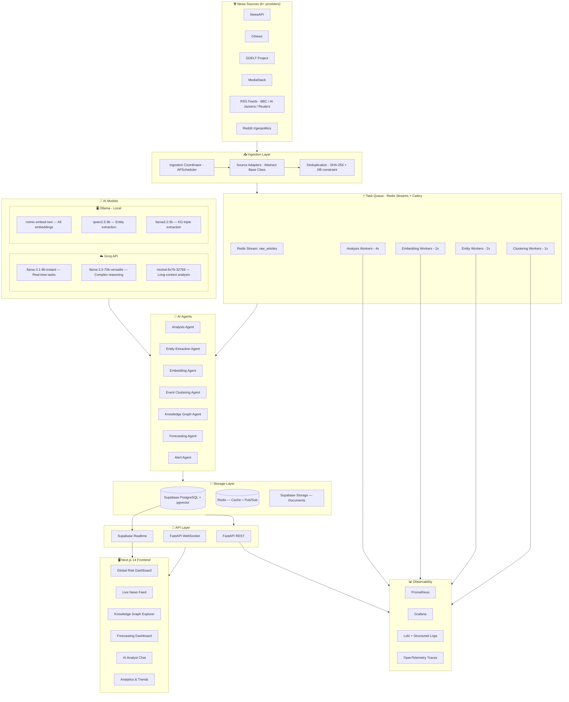
```mermaid
flowchart TB
    subgraph SOURCES["🌐 News Sources (6+ providers)"]
        S1[NewsAPI]
        S2[GNews]
        S3[GDELT Project]
        S4[MediaStack]
        S5[RSS Feeds - BBC / Al Jazeera / Reuters]
        S6[Reddit r/geopolitics]
    end

    subgraph INGESTION["📥 Ingestion Layer"]
        IC[Ingestion Coordinator - APScheduler]
        SA[Source Adapters - Abstract Base Class]
        DD[Deduplication - SHA-256 + DB constraint]
        IC --> SA --> DD
    end

    subgraph QUEUE["⚡ Task Queue - Redis Streams + Celery"]
        RQ[Redis Stream: raw_articles]
        CW1[Analysis Workers - 4x]
        CW2[Embedding Workers - 2x]
        CW3[Entity Workers - 2x]
        CW4[Clustering Workers - 1x]
    end

    subgraph AI_MODELS["🤖 AI Models"]
        subgraph GROQ["☁️ Groq API"]
            G1["llama-3.1-8b-instant — Real-time tasks"]
            G2["llama-3.3-70b-versatile — Complex reasoning"]
            G3["mixtral-8x7b-32768 — Long-context analysis"]
        end
        subgraph OLLAMA["🖥️ Ollama - Local"]
            O1["nomic-embed-text — All embeddings"]
            O2["qwen2.5:3b — Entity extraction"]
            O3["llama3.2:3b — KG triple extraction"]
        end
    end

    subgraph AGENTS["🧠 AI Agents"]
        A1[Analysis Agent]
        A2[Entity Extraction Agent]
        A3[Embedding Agent]
        A4[Event Clustering Agent]
        A5[Knowledge Graph Agent]
        A6[Forecasting Agent]
        A7[Alert Agent]
    end

    subgraph STORAGE["💾 Storage Layer"]
        PG[(Supabase PostgreSQL + pgvector)]
        RD[(Redis — Cache + Pub/Sub)]
        ST[Supabase Storage — Documents]
    end

    subgraph API_LAYER["🚀 API Layer"]
        FA[FastAPI REST]
        WS[FastAPI WebSocket]
        RT[Supabase Realtime]
    end

    subgraph FRONTEND["🖥️ Next.js 14 Frontend"]
        DASH[Global Risk Dashboard]
        FEED[Live News Feed]
        KG_VIZ[Knowledge Graph Explorer]
        FORE[Forecasting Dashboard]
        CHAT[AI Analyst Chat]
        ANALYTICS[Analytics & Trends]
    end

    subgraph OBS["📊 Observability"]
        PR[Prometheus]
        GF[Grafana]
        LK[Loki + Structured Logs]
        ST2[OpenTelemetry Traces]
    end

    SOURCES --> INGESTION
    INGESTION --> QUEUE
    QUEUE --> AGENTS
    AI_MODELS --> AGENTS
    AGENTS --> STORAGE
    STORAGE --> API_LAYER
    API_LAYER --> FRONTEND
    PG --> RT --> FRONTEND
    FA --> OBS
    CW1 & CW2 & CW3 & CW4 --> OBS
```

---

## 4. Technology Stack — Decisions & Tradeoffs

### 4.1 Stack Decision Table

| Layer | Choice | Why | Tradeoff vs Alternative |
|-------|--------|-----|------------------------|
| **Frontend** | Next.js 14 (App Router) + TypeScript | SSR for SEO, React Server Components reduce client bundle | More complex than CRA; RSC has learning curve |
| **UI Components** | Shadcn/UI + Tailwind | Unstyled, copy-paste components; no bundle overhead | Less opinionated than MUI; requires more manual composition |
| **Data Viz** | Recharts + D3.js | Recharts for charts (React-native); D3 for force graph (full control) | D3 requires manual React integration |
| **Backend** | FastAPI + Python 3.11 | Async-native, automatic OpenAPI, Python ecosystem for AI | Not as fast as Go/Rust for pure throughput; acceptable for AI workload |
| **Task Queue** | Celery + Redis Streams | Battle-tested, horizontal scaling, retry logic built-in | Kafka is overkill for < 10k articles/day at college project scale |
| **Primary DB** | Supabase PostgreSQL | Managed Postgres + pgvector + Auth + Realtime + Storage in one | Vendor lock-in risk; acceptable for portfolio project |
| **Vector Store** | pgvector (in Postgres) | No separate service; join vectors with metadata in one query | Pinecone/Weaviate have better ANN at 100M+ vectors; irrelevant at our scale |
| **Cache** | Redis | Sub-millisecond reads; also serves as Celery broker and Pub/Sub | Memcached lacks Pub/Sub; DynamoDB is overkill |
| **Auth** | Supabase Auth | JWT, OAuth, Row-Level Security built-in | Rolling your own is 2 weeks of work with more attack surface |
| **Cloud LLM** | Groq API | Fastest inference API (400-700 tok/s); free tier generous | OpenAI is slower; Anthropic more expensive; Gemini has worse function calling |
| **Local LLM** | Ollama | Zero-cost embeddings; privacy; runs on CPU | Slower than GPU inference; acceptable for batch embedding |
| **Monitoring** | Prometheus + Grafana | Industry standard; free; integrates with FastAPI via middleware | Datadog is paid; New Relic is SaaS-dependent |
| **Deployment** | Vercel (FE) + Railway (BE) + Supabase | Easiest multi-service deployment; Git push deploys | AWS gives more control but 10x the configuration overhead |

### 4.2 What NOT to Use and Why

| ❌ Rejected | ✅ Use Instead | Reason |
|------------|---------------|--------|
| SQLite | Supabase PostgreSQL | No concurrency, no vectors, not cloud-deployable |
| Pinecone / Weaviate | pgvector | Separate service for a feature Postgres can handle natively |
| LangChain | Custom agent logic | LangChain adds abstraction overhead without benefit for a known pipeline |
| Neo4j | PostgreSQL + recursive CTEs | Separate service for a graph you can model relationally at college scale |
| Kafka | Redis Streams + Celery | Kafka requires 3+ ZooKeeper nodes; overkill for < 50k events/day |
| HuggingFace hosted models | Groq + Ollama | HF inference API is slow; local Ollama is free; Groq is faster |

---

## 5. Model Routing — Groq API vs Ollama

### 5.1 Decision Framework

Route to **Groq** when: task requires high intelligence, user is waiting (latency-sensitive), or output quality is critical.
Route to **Ollama** when: task is high-volume (embeddings), batch-tolerant (entity extraction), or privacy-sensitive.

### 5.2 Model Routing Matrix

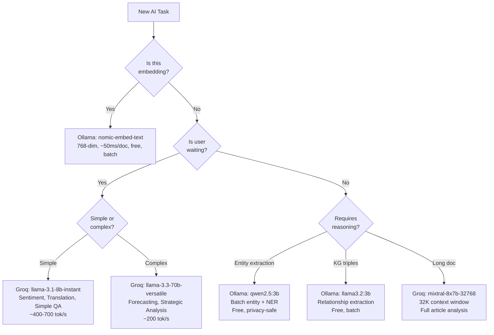
```mermaid
flowchart TD
    TASK[New AI Task] --> Q1{Is this\nembedding?}
    Q1 -->|Yes| OLLAMA_EMB["Ollama: nomic-embed-text\n768-dim, ~50ms/doc, free, batch"]
    Q1 -->|No| Q2{Is user\nwaiting?}
    Q2 -->|Yes| Q3{Simple or\ncomplex?}
    Q2 -->|No| Q4{Requires\nreasoning?}
    Q3 -->|Simple| GROQ_FAST["Groq: llama-3.1-8b-instant\nSentiment, Translation, Simple QA\n~400-700 tok/s"]
    Q3 -->|Complex| GROQ_BIG["Groq: llama-3.3-70b-versatile\nForecasting, Strategic Analysis\n~200 tok/s"]
    Q4 -->|Entity extraction| OLLAMA_QW["Ollama: qwen2.5:3b\nBatch entity + NER\nFree, privacy-safe"]
    Q4 -->|KG triples| OLLAMA_LM["Ollama: llama3.2:3b\nRelationship extraction\nFree, batch"]
    Q4 -->|Long doc| GROQ_MIX["Groq: mixtral-8x7b-32768\n32K context window\nFull article analysis"]
```

### 5.3 Task-to-Model Assignment

| Task | Model | Provider | Reason |
|------|-------|----------|--------|
| Document embedding (all articles) | `nomic-embed-text` | Ollama | High volume (~1000s/day), free, 768-dim, fast on CPU |
| Real-time sentiment + bias | `llama-3.1-8b-instant` | Groq | User-facing, needs < 1s response |
| Article summarization | `llama-3.1-8b-instant` | Groq | Balanced quality/speed |
| Entity + NER extraction | `qwen2.5:3b` | Ollama | Batch task, free, privacy-safe |
| Knowledge graph triple extraction | `llama3.2:3b` | Ollama | Batch, structured JSON output |
| Translation (non-English) | `llama-3.1-8b-instant` | Groq | Better than Google Translate for context; no rate limits |
| Geopolitical forecasting | `llama-3.3-70b-versatile` | Groq | Requires deep reasoning; quality over speed |
| RAG Q&A with citations | `llama-3.3-70b-versatile` | Groq | Intelligence + accuracy critical for analyst tool |
| Long-form strategic report | `mixtral-8x7b-32768` | Groq | 32K context handles full article batches |
| Event title + summary generation | `llama-3.1-8b-instant` | Groq | Batch but user-triggered |

### 5.4 Cost Control Strategy

```python
# Priority-based routing with fallback
class ModelRouter:
    GROQ_DAILY_TOKEN_BUDGET = 500_000  # Track via Redis counter
    
    def route(self, task_type: str, priority: str) -> tuple[str, str]:
        # Always free: use Ollama for embeddings
        if task_type == "embedding":
            return "nomic-embed-text", "ollama"
        
        # Check Groq budget
        if self._groq_budget_exceeded():
            # Fallback to local Ollama models for non-critical tasks
            if task_type in ["entity_extraction", "kg_extraction"]:
                return "qwen2.5:3b", "ollama"
        
        # Route by task type
        routing_map = {
            "sentiment": ("llama-3.1-8b-instant", "groq"),
            "translation": ("llama-3.1-8b-instant", "groq"),
            "summarization": ("llama-3.1-8b-instant", "groq"),
            "entity_extraction": ("qwen2.5:3b", "ollama"),
            "forecasting": ("llama-3.3-70b-versatile", "groq"),
            "rag_qa": ("llama-3.3-70b-versatile", "groq"),
        }
        return routing_map[task_type]
    
    def _groq_budget_exceeded(self) -> bool:
        used = redis_client.get("groq_tokens_today") or 0
        return int(used) >= self.GROQ_DAILY_TOKEN_BUDGET
```

---

## 6. Data Ingestion Layer

### 6.1 Architecture


```mermaid
flowchart LR
    subgraph SCHEDULER["APScheduler - Cron Jobs"]
        C1["Every 15min: NewsAPI, GNews"]
        C2["Every 30min: MediaStack, RSS"]
        C3["Every 60min: GDELT"]
        C4["Every 6hrs: Reddit"]
    end

    subgraph ADAPTERS["Source Adapters - Abstract Base"]
        A1[NewsAPIAdapter]
        A2[GNewsAdapter]
        A3[GDELTAdapter]
        A4[RSSAdapter]
        A5[RedditAdapter]
    end

    subgraph PIPELINE["Ingestion Pipeline"]
        FETCH[Fetch raw articles]
        NORM[Normalize to ArticleSchema]
        DEDUP[Deduplication Engine]
        FILTER[Quality Filter]
        ENRICH[Basic Enrichment]
        QUEUE[Push to Redis Stream]
    end

    SCHEDULER --> ADAPTERS
    ADAPTERS --> FETCH --> NORM --> DEDUP --> FILTER --> ENRICH --> QUEUE
```

### 6.2 Source Adapter Abstract Base

```python
# app/ingestion/base.py
from abc import ABC, abstractmethod
from dataclasses import dataclass
from datetime import datetime
from typing import AsyncIterator

@dataclass
class RawArticle:
    title: str
    content: str | None
    url: str
    source_name: str
    published_at: datetime | None
    language: str
    author: str | None = None
    image_url: str | None = None

class BaseSourceAdapter(ABC):
    def __init__(self, api_key: str | None = None):
        self.api_key = api_key
    
    @abstractmethod
    async def fetch(self) -> AsyncIterator[RawArticle]:
        """Yield articles from the source. Must handle rate limiting internally."""
        ...
    
    @abstractmethod
    def source_id(self) -> str:
        """Unique identifier for this source (matches sources table)."""
        ...
```

### 6.3 Deduplication Strategy

V1 used SHA-256 on content — keep this but add a **near-duplicate check**:

1. **Exact dedup**: SHA-256 hash on `(title + url)` → PostgreSQL unique constraint (fast, O(1))
2. **Near-dedup**: If no exact match, embed title → cosine similarity search in pgvector → if similarity > 0.95 → skip (catches reprints with minor edits)

```python
# Near-duplicate check
async def is_near_duplicate(title: str, db: AsyncSession) -> bool:
    embedding = await ollama_client.embed(title)
    result = await db.execute(
        """
        SELECT COUNT(*) FROM article_embeddings ae
        JOIN articles a ON a.id = ae.article_id
        WHERE ae.embedding <=> $1::vector < 0.05  -- cosine distance < 0.05 = similarity > 0.95
        AND a.created_at > NOW() - INTERVAL '7 days'
        """,
        [embedding]
    )
    return result.scalar() > 0
```

### 6.4 Quality Filters

Reject articles where:
- `len(content) < 100` chars (stub articles)
- `published_at` is older than 30 days (stale)
- Source is in blocklist (tabloids, known disinfo)
- Title contains only uppercase (often clickbait indicators)

---

## 7. AI Processing Pipeline

### 7.1 Full Pipeline Flow

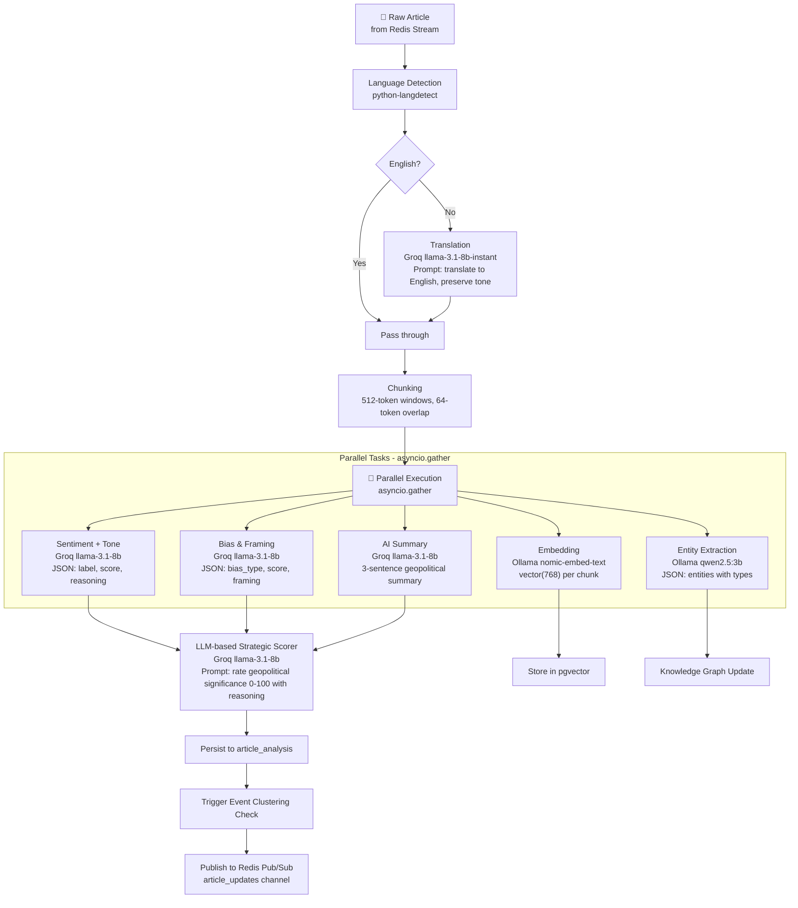
```mermaid
flowchart TD
    A["📄 Raw Article\nfrom Redis Stream"] --> B["Language Detection\npython-langdetect"]
    B --> C{English?}
    C -->|No| D["Translation\nGroq llama-3.1-8b-instant\nPrompt: translate to English, preserve tone"]
    C -->|Yes| E[Pass through]
    D --> E
    
    E --> CHUNK["Chunking\n512-token windows, 64-token overlap"]
    CHUNK --> PAR["🔀 Parallel Execution\nasyncio.gather"]
    
    subgraph PARALLEL["Parallel Tasks - asyncio.gather"]
        PAR --> T1["Sentiment + Tone\nGroq llama-3.1-8b\nJSON: label, score, reasoning"]
        PAR --> T2["Bias & Framing\nGroq llama-3.1-8b\nJSON: bias_type, score, framing"]
        PAR --> T3["AI Summary\nGroq llama-3.1-8b\n3-sentence geopolitical summary"]
        PAR --> T4["Embedding\nOllama nomic-embed-text\nvector(768) per chunk"]
        PAR --> T5["Entity Extraction\nOllama qwen2.5:3b\nJSON: entities with types"]
    end

    T1 & T2 & T3 --> SCORE["LLM-based Strategic Scorer\nGroq llama-3.1-8b\nPrompt: rate geopolitical significance 0-100 with reasoning"]
    T4 --> PGVEC["Store in pgvector"]
    T5 --> KGUPDATE["Knowledge Graph Update"]
    SCORE --> PERSIST["Persist to article_analysis"]
    PERSIST --> CLUSTER["Trigger Event Clustering Check"]
    CLUSTER --> RTPUB["Publish to Redis Pub/Sub\narticle_updates channel"]
```

### 7.2 LLM-Based Strategic Scorer (V2 vs V1)

V1 used a hardcoded formula. V2 uses the LLM:

```python
STRATEGIC_SCORER_PROMPT = """
You are a geopolitical intelligence analyst. Score this article's strategic importance 
from 0-100 based on: geopolitical impact, number of affected countries, 
involvement of major powers, conflict escalation potential, and economic consequences.

Article:
Title: {title}
Summary: {summary}
Sentiment: {sentiment}
Key Entities: {entities}

Respond ONLY with a valid JSON object:
{{
  "strategic_score": <int 0-100>,
  "risk_level": "<Low|Medium|High|Critical>",
  "key_drivers": ["<driver1>", "<driver2>"],
  "affected_regions": ["<region1>"],
  "reasoning": "<2 sentence explanation>"
}}
"""
```

This produces explainable, context-aware scores rather than a fixed arithmetic formula.

---

## 8. AI Agent Workflows

### 8.1 Agent Architecture Overview

Agents are implemented as **Celery tasks** with shared state in PostgreSQL and Redis. No external orchestration framework (LangChain/LangGraph) — direct implementation for clarity and control.

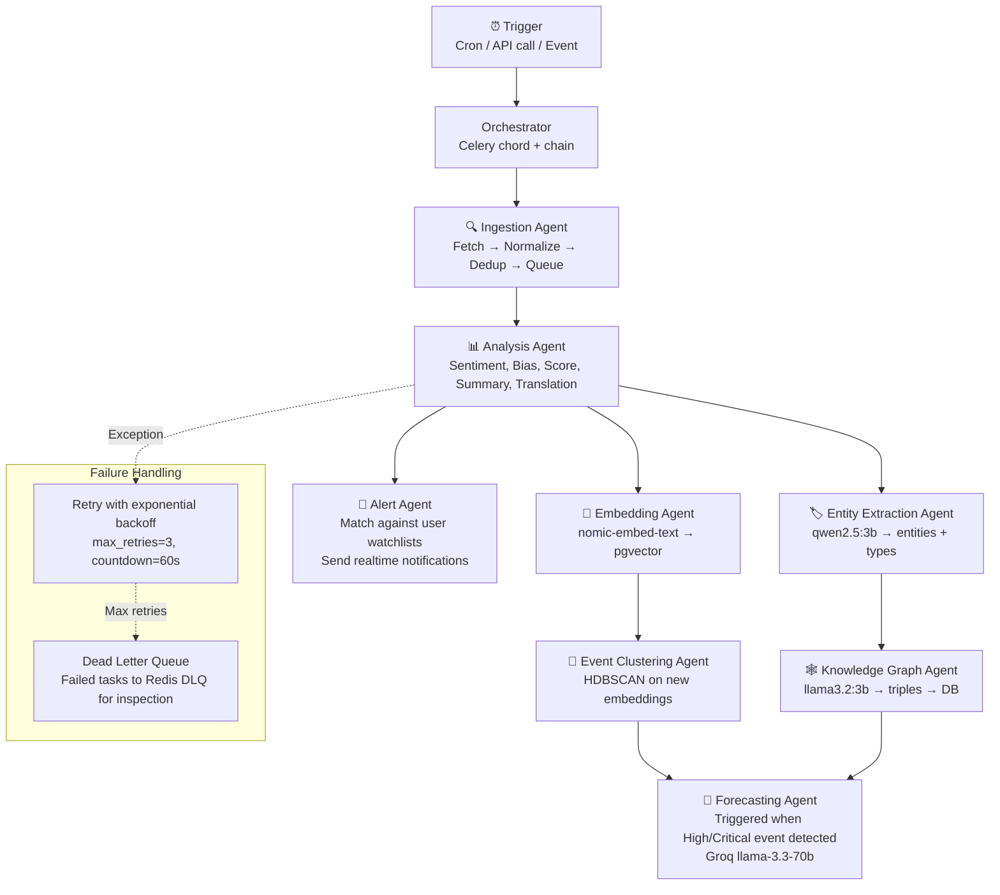
```mermaid
flowchart TD
    TRIGGER["⏰ Trigger\nCron / API call / Event"] --> ORCH["Orchestrator\nCelery chord + chain"]
    
    ORCH --> INGEST_AGT["🔍 Ingestion Agent\nFetch → Normalize → Dedup → Queue"]
    INGEST_AGT --> ANALYSIS_AGT["📊 Analysis Agent\nSentiment, Bias, Score, Summary, Translation"]
    ANALYSIS_AGT --> EMB_AGT["🔢 Embedding Agent\nnomic-embed-text → pgvector"]
    ANALYSIS_AGT --> ENTITY_AGT["🏷️ Entity Extraction Agent\nqwen2.5:3b → entities + types"]
    
    EMB_AGT --> CLUSTER_AGT["🔵 Event Clustering Agent\nHDBSCAN on new embeddings"]
    ENTITY_AGT --> KG_AGT["🕸️ Knowledge Graph Agent\nllama3.2:3b → triples → DB"]
    
    CLUSTER_AGT --> FORECAST_AGT["🔮 Forecasting Agent\nTriggered when High/Critical event detected\nGroq llama-3.3-70b"]
    KG_AGT --> FORECAST_AGT
    
    ANALYSIS_AGT --> ALERT_AGT["🔔 Alert Agent\nMatch against user watchlists\nSend realtime notifications"]
    
    subgraph FAILURE["Failure Handling"]
        RETRY["Retry with exponential backoff\nmax_retries=3, countdown=60s"]
        DLQ["Dead Letter Queue\nFailed tasks to Redis DLQ for inspection"]
    end
    
    ANALYSIS_AGT -.->|Exception| RETRY
    RETRY -.->|Max retries| DLQ
```

### 8.2 Agent Implementation Pattern

```python
# app/agents/analysis_agent.py
from celery import Task
from app.core.celery_app import celery_app
from app.ai.groq_client import GroqClient
from app.db.repositories import ArticleRepository
import structlog

logger = structlog.get_logger()

class AnalysisAgent(Task):
    # Celery task with state — model clients initialized once, not per-call
    abstract = True
    _groq_client = None
    
    @property
    def groq(self):
        if self._groq_client is None:
            self._groq_client = GroqClient()
        return self._groq_client

@celery_app.task(
    bind=True, 
    base=AnalysisAgent,
    max_retries=3, 
    default_retry_delay=60,
    name="agents.analyze_article"
)
async def analyze_article(self, article_id: str) -> dict:
    log = logger.bind(article_id=article_id, task_id=self.request.id)
    try:
        async with get_db_session() as db:
            repo = ArticleRepository(db)
            article = await repo.get(article_id)
            
            if not article:
                log.error("article_not_found")
                return {"status": "skipped", "reason": "not_found"}
            
            # Parallel execution
            results = await asyncio.gather(
                self.groq.analyze_sentiment(article.content),
                self.groq.detect_bias(article.content),
                self.groq.generate_summary(article.content),
                return_exceptions=True
            )
            
            # Handle partial failures gracefully
            sentiment, bias, summary = [
                r if not isinstance(r, Exception) else None 
                for r in results
            ]
            
            if not sentiment:
                log.warning("sentiment_failed", retrying=True)
                raise self.retry(exc=results[0])
            
            score_result = await self.groq.compute_strategic_score(
                article, sentiment, bias, summary
            )
            
            await repo.save_analysis(article_id, {
                "sentiment_label": sentiment["label"],
                "sentiment_score": sentiment["score"],
                "bias_label": bias["label"] if bias else "Unknown",
                "bias_score": bias["score"] if bias else 0.0,
                "summary": summary,
                "strategic_score": score_result["strategic_score"],
                "risk_level": score_result["risk_level"],
                "key_drivers": score_result["key_drivers"],
                "affected_regions": score_result["affected_regions"],
            })
            
            log.info("analysis_complete", score=score_result["strategic_score"])
            
            # Trigger downstream agents
            embed_article.delay(article_id)
            extract_entities.delay(article_id)
            check_watchlist_alerts.delay(article_id)
            
            return {"status": "success", "article_id": article_id}
    
    except Exception as exc:
        log.exception("analysis_failed")
        raise self.retry(exc=exc)
```

### 8.3 Forecasting Agent — Multi-Step Chain

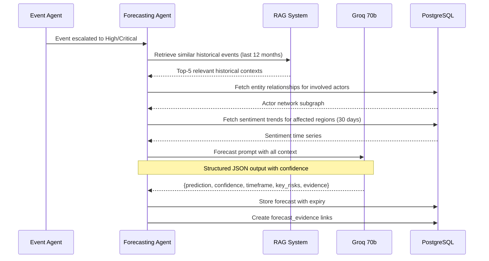
```mermaid
sequenceDiagram
    participant EA as Event Agent
    participant FA as Forecasting Agent
    participant RAG as RAG System
    participant GROQ as Groq 70b
    participant DB as PostgreSQL

    EA->>FA: Event escalated to High/Critical
    FA->>RAG: Retrieve similar historical events (last 12 months)
    RAG-->>FA: Top-5 relevant historical contexts
    FA->>DB: Fetch entity relationships for involved actors
    DB-->>FA: Actor network subgraph
    FA->>DB: Fetch sentiment trends for affected regions (30 days)
    DB-->>FA: Sentiment time series
    FA->>GROQ: Forecast prompt with all context
    Note over FA,GROQ: Structured JSON output with confidence
    GROQ-->>FA: {prediction, confidence, timeframe, key_risks, evidence}
    FA->>DB: Store forecast with expiry
    FA->>DB: Create forecast_evidence links
```

---

## 9. RAG Architecture

### 9.1 Overview

RAG powers the **AI Analyst Chat** — users ask geopolitical questions and get answers grounded in your ingested article corpus, with clickable source citations.

### 9.2 Indexing Pipeline

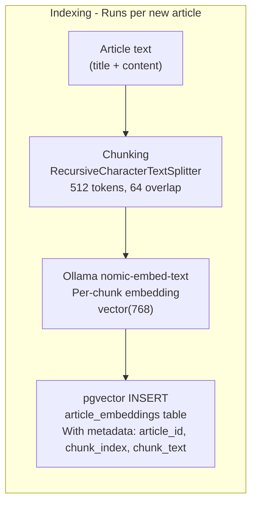
```mermaid
flowchart LR
    subgraph INDEXING["Indexing - Runs per new article"]
        A["Article text\n(title + content)"] --> B["Chunking\nRecursiveCharacterTextSplitter\n512 tokens, 64 overlap"]
        B --> C["Ollama nomic-embed-text\nPer-chunk embedding\nvector(768)"]
        C --> D["pgvector INSERT\narticle_embeddings table\nWith metadata: article_id, chunk_index, chunk_text"]
    end
```

### 9.3 Retrieval Pipeline — Hybrid Search

Single-strategy retrieval is weak. Use **hybrid retrieval** combining vector similarity + PostgreSQL full-text search + date recency weighting:

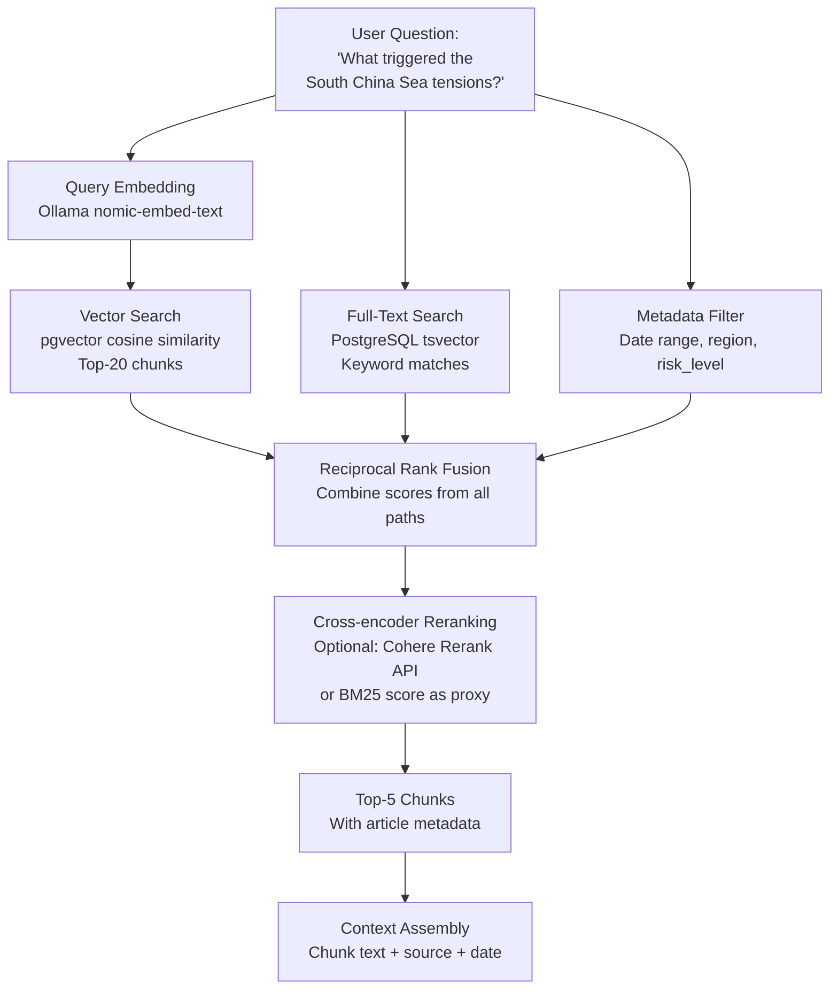
```mermaid
flowchart TD
    Q["User Question:\n'What triggered the\nSouth China Sea tensions?'"] --> QE["Query Embedding\nOllama nomic-embed-text"]
    
    QE --> VS["Vector Search\npgvector cosine similarity\nTop-20 chunks"]
    Q --> FTS["Full-Text Search\nPostgreSQL tsvector\nKeyword matches"]
    Q --> FILTER["Metadata Filter\nDate range, region, risk_level"]
    
    VS --> MERGE["Reciprocal Rank Fusion\nCombine scores from all paths"]
    FTS --> MERGE
    FILTER --> MERGE
    
    MERGE --> RERANK["Cross-encoder Reranking\nOptional: Cohere Rerank API\nor BM25 score as proxy"]
    RERANK --> TOPK["Top-5 Chunks\nWith article metadata"]
    TOPK --> CTX["Context Assembly\nChunk text + source + date"]
```

### 9.4 Generation Pipeline

```python
# app/rag/query_engine.py
RAG_SYSTEM_PROMPT = """
You are a geopolitical intelligence analyst with access to a database of recent news articles.
Answer the user's question using ONLY the provided context articles.
If the context doesn't contain sufficient information, say so explicitly.
Always cite your sources using [Source N] notation.

Rules:
- Be analytical, not descriptive
- Highlight causal relationships, not just facts
- If multiple sources conflict, acknowledge the disagreement
- End with a confidence level: [High/Medium/Low confidence]
"""

async def rag_query(question: str, user_id: str) -> dict:
    # 1. Retrieve context
    chunks = await hybrid_retrieval(question, top_k=5)
    
    # 2. Build context string with citations
    context_parts = []
    for i, chunk in enumerate(chunks, 1):
        context_parts.append(
            f"[Source {i}] {chunk.article_title} ({chunk.published_at.date()}, {chunk.source_name})\n"
            f"{chunk.chunk_text}"
        )
    context = "\n\n---\n\n".join(context_parts)
    
    # 3. Generate answer via Groq 70b
    response = await groq_client.chat(
        model="llama-3.3-70b-versatile",
        system=RAG_SYSTEM_PROMPT,
        messages=[
            {"role": "user", "content": f"Context:\n{context}\n\nQuestion: {question}"}
        ],
        temperature=0.1,  # Low temp for factual grounding
        max_tokens=1000
    )
    
    # 4. Return answer + source articles for citation links
    return {
        "answer": response.content,
        "sources": [{"id": c.article_id, "title": c.article_title, "url": c.url} for c in chunks],
        "retrieval_scores": [c.score for c in chunks]
    }
```

### 9.5 Hybrid Search SQL

```sql
-- Hybrid search: vector similarity + full-text search combined via RRF
WITH vector_results AS (
    SELECT
        ae.article_id,
        ae.chunk_text,
        ae.chunk_index,
        1 - (ae.embedding <=> $1::vector) AS vector_score,
        ROW_NUMBER() OVER (ORDER BY ae.embedding <=> $1::vector) AS vector_rank
    FROM article_embeddings ae
    JOIN articles a ON a.id = ae.article_id
    WHERE a.published_at > NOW() - INTERVAL '90 days'
    ORDER BY ae.embedding <=> $1::vector
    LIMIT 20
),
fts_results AS (
    SELECT
        a.id AS article_id,
        ts_rank(a.search_vector, plainto_tsquery('english', $2)) AS fts_score,
        ROW_NUMBER() OVER (ORDER BY ts_rank(a.search_vector, plainto_tsquery('english', $2)) DESC) AS fts_rank
    FROM articles a
    WHERE a.search_vector @@ plainto_tsquery('english', $2)
    LIMIT 20
),
rrf AS (
    -- Reciprocal Rank Fusion: score = 1/(k + rank)
    SELECT
        COALESCE(vr.article_id, fr.article_id) AS article_id,
        vr.chunk_text,
        COALESCE(1.0 / (60 + vr.vector_rank), 0) + COALESCE(1.0 / (60 + fr.fts_rank), 0) AS rrf_score
    FROM vector_results vr
    FULL OUTER JOIN fts_results fr ON vr.article_id = fr.article_id
)
SELECT r.article_id, r.chunk_text, r.rrf_score, a.title, a.url, a.source_name, a.published_at
FROM rrf r
JOIN articles a ON a.id = r.article_id
ORDER BY r.rrf_score DESC
LIMIT 5;
```

---

## 10. Vector Search Architecture

### 10.1 pgvector Setup

```sql
-- Enable extension
CREATE EXTENSION IF NOT EXISTS vector;

-- Add tsvector column for hybrid search
ALTER TABLE articles ADD COLUMN search_vector tsvector
    GENERATED ALWAYS AS (
        to_tsvector('english', coalesce(title, '') || ' ' || coalesce(content_raw, ''))
    ) STORED;

CREATE INDEX ON articles USING GIN(search_vector);

-- Vector table with HNSW index (better query perf than IVFFlat for < 1M vectors)
CREATE TABLE article_embeddings (
    id UUID PRIMARY KEY DEFAULT gen_random_uuid(),
    article_id UUID REFERENCES articles(id) ON DELETE CASCADE,
    chunk_text TEXT NOT NULL,
    chunk_index INTEGER NOT NULL,
    embedding vector(768) NOT NULL,  -- nomic-embed-text dimension
    model TEXT DEFAULT 'nomic-embed-text',
    created_at TIMESTAMPTZ DEFAULT NOW()
);

-- HNSW index: O(log n) search, better recall than IVFFlat, slower to build
-- ef_construction=128, m=16 is good default for recall/speed tradeoff
CREATE INDEX ON article_embeddings 
USING hnsw (embedding vector_cosine_ops)
WITH (m = 16, ef_construction = 128);
```

### 10.2 Search Strategies Summary

| Strategy | Use Case | Latency | Recall |
|----------|----------|---------|--------|
| Pure vector (cosine) | "Similar articles" | < 50ms | Good for semantic |
| Pure FTS (tsvector) | Exact keyword search | < 10ms | Good for named entities |
| Hybrid (RRF) | AI Analyst Q&A | < 100ms | Best overall |
| Filtered vector | "Similar articles in Middle East" | < 60ms | Good + precise |

### 10.3 Entity Embeddings (for Knowledge Graph Search)

Beyond article embeddings, also embed **entity descriptions** to enable semantic entity search:

```sql
CREATE TABLE entity_embeddings (
    entity_id UUID REFERENCES entities(id) ON DELETE CASCADE,
    embedding vector(768),
    PRIMARY KEY (entity_id)
);
-- Used for: "find entities related to economic sanctions"
```

---

## 11. Event Detection & Clustering System

### 11.1 What an "Event" Is

An event is a **cluster of articles** discussing the same real-world story (e.g., "Russia-Ukraine Ceasefire Negotiations, March 2025"). Events evolve over time as new articles are added to them.

### 11.2 Clustering Pipeline

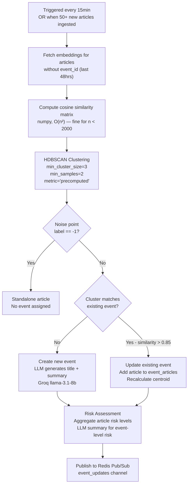
```mermaid
flowchart TD
    TRIGGER["Triggered every 15min\nOR when 50+ new articles ingested"] --> FETCH["Fetch embeddings for articles\nwithout event_id (last 48hrs)"]
    FETCH --> MATRIX["Compute cosine similarity matrix\nnumpy, O(n²) — fine for n < 2000"]
    MATRIX --> HDBSCAN["HDBSCAN Clustering\nmin_cluster_size=3\nmin_samples=2\nmetric='precomputed'"]
    
    HDBSCAN --> NOISE{Noise point\nlabel == -1?}
    NOISE -->|Yes| STANDALONE["Standalone article\nNo event assigned"]
    NOISE -->|No| EXISTING{Cluster matches\nexisting event?}
    
    EXISTING -->|Yes - similarity > 0.85| UPDATE["Update existing event\nAdd article to event_articles\nRecalculate centroid"]
    EXISTING -->|No| NEW["Create new event\nLLM generates title + summary\nGroq llama-3.1-8b"]
    
    NEW --> RISK["Risk Assessment\nAggregate article risk levels\nLLM summary for event-level risk"]
    UPDATE --> RISK
    RISK --> NOTIFY["Publish to Redis Pub/Sub\nevent_updates channel"]
```

### 11.3 Implementation

```python
# app/agents/clustering_agent.py
import numpy as np
import hdbscan
from sklearn.metrics.pairwise import cosine_similarity

async def run_event_clustering() -> dict:
    # 1. Fetch recent unassigned article embeddings
    async with get_db_session() as db:
        rows = await db.execute("""
            SELECT ae.article_id, ae.embedding
            FROM article_embeddings ae
            JOIN articles a ON a.id = ae.article_id
            LEFT JOIN event_articles ea ON ea.article_id = ae.article_id
            WHERE ea.event_id IS NULL
            AND a.created_at > NOW() - INTERVAL '48 hours'
            AND ae.chunk_index = 0  -- Use first chunk as article representative
        """)
        results = rows.fetchall()
    
    if len(results) < 3:  # Need minimum for clustering
        return {"clustered": 0}
    
    article_ids = [r.article_id for r in results]
    embeddings = np.array([r.embedding for r in results])
    
    # 2. Compute cosine distance matrix (HDBSCAN uses precomputed distances)
    similarity = cosine_similarity(embeddings)
    distance_matrix = 1 - similarity  # cosine distance
    distance_matrix = np.clip(distance_matrix, 0, 1)  # numerical safety
    
    # 3. HDBSCAN
    clusterer = hdbscan.HDBSCAN(
        min_cluster_size=3,
        min_samples=2,
        metric='precomputed',
        cluster_selection_epsilon=0.15,  # Allow loose clusters for breaking news
    )
    labels = clusterer.fit_predict(distance_matrix)
    probabilities = clusterer.probabilities_
    
    # 4. Process each cluster
    cluster_map: dict[int, list] = {}
    for article_id, label, prob in zip(article_ids, labels, probabilities):
        if label != -1:  # -1 is noise
            cluster_map.setdefault(label, []).append((article_id, prob))
    
    # 5. Match clusters to existing events or create new ones
    for cluster_label, members in cluster_map.items():
        await _assign_or_create_event(members)
    
    return {"clustered": sum(len(m) for m in cluster_map.values()), "events": len(cluster_map)}


async def _assign_or_create_event(members: list[tuple[str, float]]) -> None:
    # Compute cluster centroid
    member_ids = [m[0] for m in members]
    centroid = await compute_centroid(member_ids)
    
    # Check if this cluster matches an existing recent event
    existing_event = await find_similar_event(centroid, threshold=0.85)
    
    if existing_event:
        await add_articles_to_event(existing_event.id, members)
    else:
        # Get representative articles for LLM title generation
        rep_articles = await get_representative_articles(member_ids, n=3)
        event_meta = await generate_event_metadata(rep_articles)  # Groq LLM call
        await create_new_event(event_meta, members)
```

### 11.4 Event Metadata Generation Prompt

```python
EVENT_GENERATION_PROMPT = """
These news articles cover the same geopolitical event. Generate a concise event record.

Articles:
{article_summaries}

Respond ONLY with valid JSON:
{{
  "title": "<Concise event title, max 80 chars, e.g. 'US-China Trade War Escalation'>",
  "description": "<2-3 sentence summary of what is happening and why it matters>",
  "status": "<ongoing|resolved|escalating|de-escalating>",
  "risk_level": "<Low|Medium|High|Critical>",
  "involved_entities": ["<entity1>", "<entity2>"],
  "affected_regions": ["<region1>"]
}}
"""
```

---

## 12. Knowledge Graph Architecture

### 12.1 Graph Model

Implemented in **PostgreSQL** (no Neo4j — overkill at college scale). Recursive CTEs handle graph traversal.

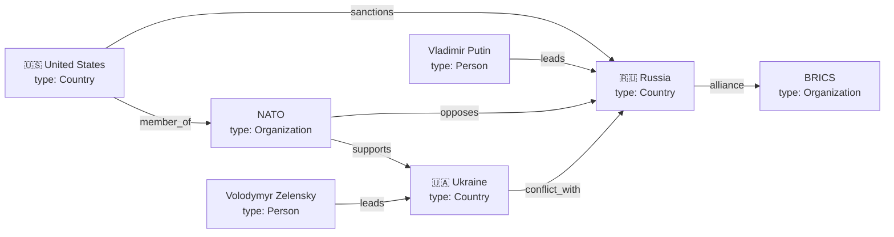
```mermaid
graph LR
    RUSSIA["🇷🇺 Russia\ntype: Country"] --"alliance"--> BRICS["BRICS\ntype: Organization"]
    USA["🇺🇸 United States\ntype: Country"] --"sanctions"--> RUSSIA
    PUTIN["Vladimir Putin\ntype: Person"] --"leads"--> RUSSIA
    NATO["NATO\ntype: Organization"] --"opposes"--> RUSSIA
    USA --"member_of"--> NATO
    UKRAINE["🇺🇦 Ukraine\ntype: Country"] --"conflict_with"--> RUSSIA
    NATO --"supports"--> UKRAINE
    ZELENSKY["Volodymyr Zelensky\ntype: Person"] --"leads"--> UKRAINE
```

### 12.2 Entity Extraction Pipeline

```python
# app/agents/kg_agent.py
ENTITY_EXTRACTION_PROMPT = """
Extract entities and relationships from this news article.

Article: {article_text}

Extract:
1. Entities: Named people, countries, organizations, treaties, agreements
2. Relationships between those entities AS THEY APPEAR IN THIS ARTICLE

Respond ONLY with valid JSON:
{{
  "entities": [
    {{"name": "string", "type": "Person|Country|Organization|Treaty|Agreement|Concept", "description": "string"}}
  ],
  "relations": [
    {{"from": "entity_name", "relation": "relation_type", "to": "entity_name", "confidence": 0.0-1.0}}
  ]
}}

Valid relation types: leads, member_of, opposes, supports, sanctions, alliance_with, 
conflict_with, negotiates_with, signed, owns, located_in, accused_of
"""

async def extract_and_update_graph(article_id: str, article_text: str) -> None:
    # 1. Extract via Ollama qwen2.5:3b (free, batch-safe)
    response = await ollama_client.generate(
        model="qwen2.5:3b",
        prompt=ENTITY_EXTRACTION_PROMPT.format(article_text=article_text[:3000]),
        format="json"
    )
    
    data = json.loads(response["response"])
    
    async with get_db_session() as db:
        # 2. Upsert entities (name + type = unique key)
        entity_id_map = {}
        for entity in data.get("entities", []):
            entity_id = await upsert_entity(
                db, name=entity["name"], type=entity["type"],
                description=entity.get("description")
            )
            entity_id_map[entity["name"]] = entity_id
        
        # 3. Upsert relations with evidence tracking
        for rel in data.get("relations", []):
            from_id = entity_id_map.get(rel["from"])
            to_id = entity_id_map.get(rel["to"])
            if from_id and to_id:
                await upsert_relation(
                    db, from_id=from_id, to_id=to_id,
                    relation_type=rel["relation"],
                    confidence=rel["confidence"],
                    article_id=article_id  # Evidence trail
                )
```

### 12.3 Graph Traversal Query

```sql
-- Find all entities within 2 hops of "Vladimir Putin"
WITH RECURSIVE entity_graph AS (
    -- Anchor: starting entity
    SELECT 
        e.id, e.name, e.type, 
        0 AS depth,
        ARRAY[e.id] AS path
    FROM entities e WHERE e.name = 'Vladimir Putin'
    
    UNION ALL
    
    -- Recursive: follow relations outward
    SELECT 
        e2.id, e2.name, e2.type,
        eg.depth + 1,
        eg.path || e2.id
    FROM entity_graph eg
    JOIN entity_relations er ON er.from_entity_id = eg.id
    JOIN entities e2 ON e2.id = er.to_entity_id
    WHERE eg.depth < 2                -- Max 2 hops
    AND NOT (e2.id = ANY(eg.path))    -- No cycles
)
SELECT DISTINCT id, name, type, depth
FROM entity_graph
ORDER BY depth, name;
```

---

## 13. Geopolitical Forecasting Engine

### 13.1 Architecture

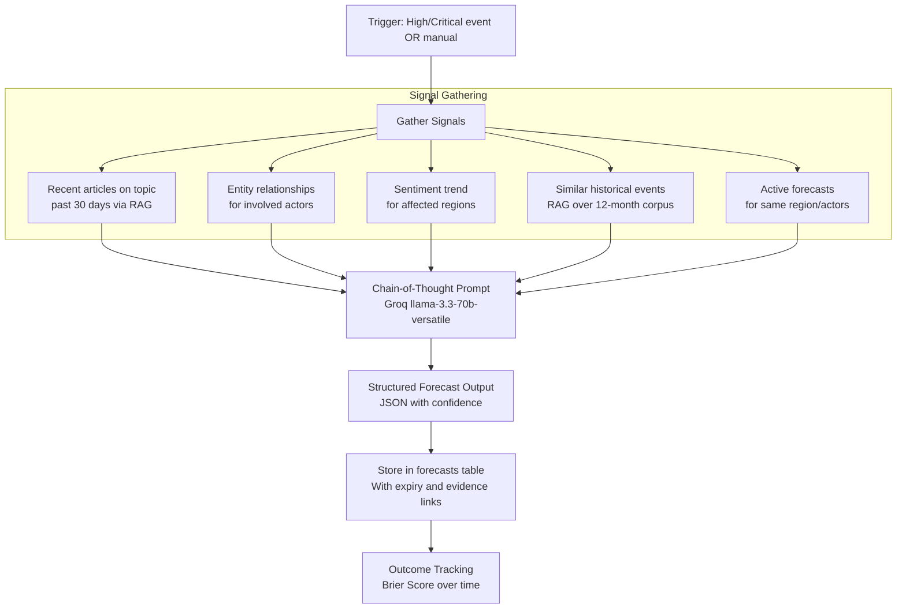
```mermaid
flowchart TD
    TRIGGER["Trigger: High/Critical event OR manual"] --> GATHER["Gather Signals"]
    
    subgraph SIGNALS["Signal Gathering"]
        GATHER --> SIG1["Recent articles on topic\npast 30 days via RAG"]
        GATHER --> SIG2["Entity relationships\nfor involved actors"]
        GATHER --> SIG3["Sentiment trend\nfor affected regions"]
        GATHER --> SIG4["Similar historical events\nRAG over 12-month corpus"]
        GATHER --> SIG5["Active forecasts\nfor same region/actors"]
    end
    
    SIG1 & SIG2 & SIG3 & SIG4 & SIG5 --> COT["Chain-of-Thought Prompt\nGroq llama-3.3-70b-versatile"]
    COT --> OUT["Structured Forecast Output\nJSON with confidence"]
    OUT --> STORE["Store in forecasts table\nWith expiry and evidence links"]
    STORE --> TRACK["Outcome Tracking\nBrier Score over time"]
```

### 13.2 Forecasting Prompt (Chain-of-Thought)

```python
FORECAST_PROMPT = """
You are a senior geopolitical analyst producing an intelligence forecast.

## Current Event
{event_title}: {event_description}
Risk Level: {risk_level}
Involved Actors: {actors}
Affected Regions: {regions}

## Recent Article Context (last 30 days)
{rag_context}

## Historical Precedents
{historical_context}

## Sentiment Trend (past 30 days for affected regions)
{sentiment_trend}

## Actor Relationships
{entity_relationships}

## Instructions
Think step-by-step:
1. Identify the key drivers of this situation
2. Consider what historical precedents suggest
3. Assess what the major powers are likely to do
4. Evaluate escalation vs de-escalation signals

Then provide your forecast:

Respond ONLY with valid JSON:
{{
  "topic": "<event topic>",
  "prediction": "<Specific, falsifiable prediction statement>",
  "confidence": <0.0-1.0, where 0.5 = total uncertainty>,
  "timeframe": "<e.g. '3-6 months', '30 days', '1 year'>",
  "risk_level": "<Low|Medium|High|Critical>",
  "key_scenarios": [
    {{"scenario": "string", "probability": 0.0-1.0, "triggers": ["string"]}}
  ],
  "key_risks": ["string"],
  "evidence_summary": "<2-3 sentences citing specific evidence>",
  "chain_of_thought": "<Your reasoning process>"
}}
"""
```

### 13.3 Forecast Accuracy Tracking

Track prediction accuracy using Brier Score (used in forecasting competitions):

```python
# When a forecast expires, log outcome
async def record_forecast_outcome(forecast_id: str, occurred: bool) -> None:
    """
    Brier Score = (probability - outcome)^2
    Perfect: 0.0, Random: 0.25, Worst: 1.0
    """
    forecast = await get_forecast(forecast_id)
    brier_score = (forecast.confidence - float(occurred)) ** 2
    
    await db.execute("""
        UPDATE forecasts 
        SET outcome_occurred = $1, brier_score = $2, resolved_at = NOW()
        WHERE id = $3
    """, [occurred, brier_score, forecast_id])
```

This gives you a **measurable evaluation metric** to show in your portfolio (e.g., "average Brier Score of 0.18 across 45 forecasts").

---

## 14. Real-time Streaming Architecture

### 14.1 Three Real-time Paths

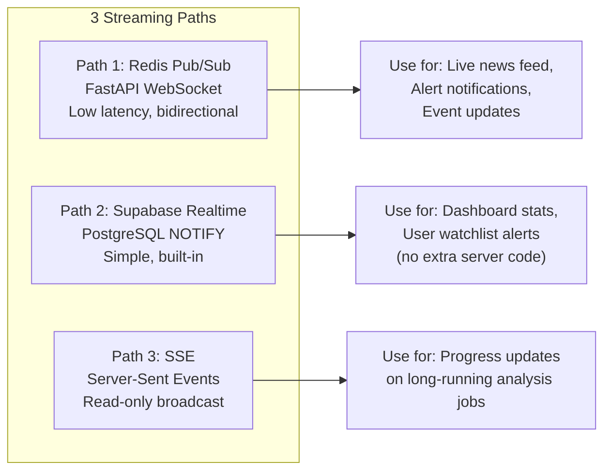
```mermaid
flowchart LR
    subgraph PATHS["3 Streaming Paths"]
        P1["Path 1: Redis Pub/Sub\nFastAPI WebSocket\nLow latency, bidirectional"]
        P2["Path 2: Supabase Realtime\nPostgreSQL NOTIFY\nSimple, built-in"]
        P3["Path 3: SSE\nServer-Sent Events\nRead-only broadcast"]
    end
    
    P1 --> USE1["Use for: Live news feed,\nAlert notifications,\nEvent updates"]
    P2 --> USE2["Use for: Dashboard stats,\nUser watchlist alerts\n(no extra server code)"]
    P3 --> USE3["Use for: Progress updates\non long-running analysis jobs"]
```

### 14.2 WebSocket Server

```python
# app/api/websockets.py
from fastapi import WebSocket, WebSocketDisconnect, Depends
import asyncio, json, redis.asyncio as aioredis

class ConnectionManager:
    def __init__(self):
        self.connections: dict[str, set[WebSocket]] = {}  # channel -> sockets
    
    async def connect(self, ws: WebSocket, channel: str, user_id: str):
        await ws.accept()
        self.connections.setdefault(channel, set()).add(ws)
    
    async def disconnect(self, ws: WebSocket, channel: str):
        self.connections.get(channel, set()).discard(ws)
    
    async def broadcast(self, channel: str, message: dict):
        dead = set()
        for ws in self.connections.get(channel, set()):
            try:
                await ws.send_json(message)
            except Exception:
                dead.add(ws)
        self.connections[channel] -= dead

manager = ConnectionManager()

@router.websocket("/ws/feed")
async def news_feed_ws(ws: WebSocket, token: str):
    user = await verify_jwt(token)  # Auth check
    await manager.connect(ws, "news_feed", user.id)
    
    redis = await aioredis.create_redis_pool("redis://localhost")
    sub = await redis.subscribe("article_updates")
    
    try:
        async for message in sub[0].iter():
            if message:
                data = json.loads(message)
                await ws.send_json({"type": "new_article", "data": data})
    except WebSocketDisconnect:
        await manager.disconnect(ws, "news_feed")
    finally:
        redis.close()
```

### 14.3 Full Sequence: Article → Dashboard

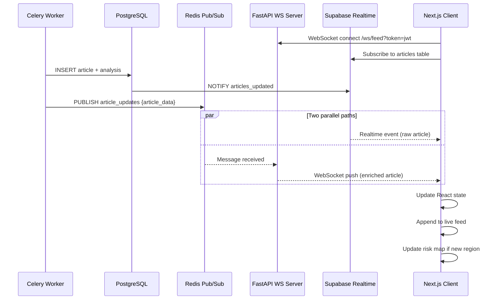
```mermaid
sequenceDiagram
    participant WORKER as Celery Worker
    participant DB as PostgreSQL
    participant REDIS as Redis Pub/Sub
    participant API as FastAPI WS Server
    participant RT as Supabase Realtime
    participant CLIENT as Next.js Client

    CLIENT->>API: WebSocket connect /ws/feed?token=jwt
    CLIENT->>RT: Subscribe to articles table

    WORKER->>DB: INSERT article + analysis
    DB->>RT: NOTIFY articles_updated
    WORKER->>REDIS: PUBLISH article_updates {article_data}

    par Two parallel paths
        RT-->>CLIENT: Realtime event (raw article)
    and
        REDIS-->>API: Message received
        API-->>CLIENT: WebSocket push (enriched article)
    end

    CLIENT->>CLIENT: Update React state
    CLIENT->>CLIENT: Append to live feed
    CLIENT->>CLIENT: Update risk map if new region
```

---

## 15. Database Schema Design

### 15.1 Entity-Relationship Diagram

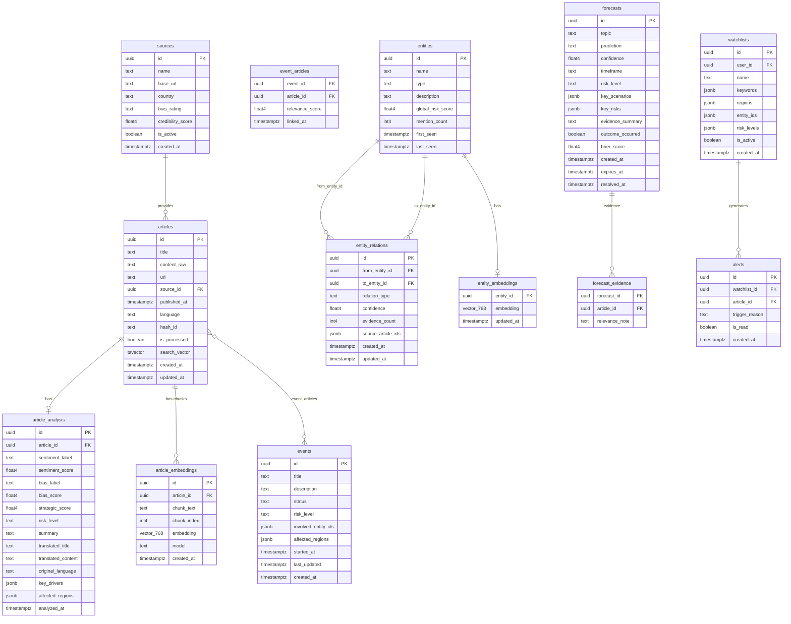
```mermaid
erDiagram
    sources {
        uuid id PK
        text name
        text base_url
        text country
        text bias_rating
        float4 credibility_score
        boolean is_active
        timestamptz created_at
    }

    articles {
        uuid id PK
        text title
        text content_raw
        text url
        uuid source_id FK
        timestamptz published_at
        text language
        text hash_id
        boolean is_processed
        tsvector search_vector
        timestamptz created_at
        timestamptz updated_at
    }

    article_analysis {
        uuid id PK
        uuid article_id FK
        text sentiment_label
        float4 sentiment_score
        text bias_label
        float4 bias_score
        float4 strategic_score
        text risk_level
        text summary
        text translated_title
        text translated_content
        text original_language
        jsonb key_drivers
        jsonb affected_regions
        timestamptz analyzed_at
    }

    article_embeddings {
        uuid id PK
        uuid article_id FK
        text chunk_text
        int4 chunk_index
        vector_768 embedding
        text model
        timestamptz created_at
    }

    events {
        uuid id PK
        text title
        text description
        text status
        text risk_level
        jsonb involved_entity_ids
        jsonb affected_regions
        timestamptz started_at
        timestamptz last_updated
        timestamptz created_at
    }

    event_articles {
        uuid event_id FK
        uuid article_id FK
        float4 relevance_score
        timestamptz linked_at
    }

    entities {
        uuid id PK
        text name
        text type
        text description
        float4 global_risk_score
        int4 mention_count
        timestamptz first_seen
        timestamptz last_seen
    }

    entity_relations {
        uuid id PK
        uuid from_entity_id FK
        uuid to_entity_id FK
        text relation_type
        float4 confidence
        int4 evidence_count
        jsonb source_article_ids
        timestamptz created_at
        timestamptz updated_at
    }

    entity_embeddings {
        uuid entity_id FK
        vector_768 embedding
        timestamptz updated_at
    }

    forecasts {
        uuid id PK
        text topic
        text prediction
        float4 confidence
        text timeframe
        text risk_level
        jsonb key_scenarios
        jsonb key_risks
        text evidence_summary
        boolean outcome_occurred
        float4 brier_score
        timestamptz created_at
        timestamptz expires_at
        timestamptz resolved_at
    }

    forecast_evidence {
        uuid forecast_id FK
        uuid article_id FK
        text relevance_note
    }

    watchlists {
        uuid id PK
        uuid user_id FK
        text name
        jsonb keywords
        jsonb regions
        jsonb entity_ids
        jsonb risk_levels
        boolean is_active
        timestamptz created_at
    }

    alerts {
        uuid id PK
        uuid watchlist_id FK
        uuid article_id FK
        text trigger_reason
        boolean is_read
        timestamptz created_at
    }

    sources ||--o{ articles : "provides"
    articles ||--o| article_analysis : "has"
    articles ||--o{ article_embeddings : "has chunks"
    articles }o--o{ events : "event_articles"
    entities ||--o{ entity_relations : "from_entity_id"
    entities ||--o{ entity_relations : "to_entity_id"
    entities ||--o| entity_embeddings : "has"
    forecasts ||--o{ forecast_evidence : "evidence"
    watchlists ||--o{ alerts : "generates"
```

### 15.2 Key PostgreSQL Performance Indexes

```sql
-- Articles
CREATE UNIQUE INDEX ON articles (hash_id);
CREATE INDEX ON articles (published_at DESC);
CREATE INDEX ON articles (source_id);
CREATE INDEX ON articles USING GIN (search_vector);

-- Article analysis
CREATE UNIQUE INDEX ON article_analysis (article_id);
CREATE INDEX ON article_analysis (strategic_score DESC);
CREATE INDEX ON article_analysis (risk_level);

-- Embeddings - HNSW for fast ANN
CREATE INDEX ON article_embeddings USING hnsw (embedding vector_cosine_ops)
WITH (m = 16, ef_construction = 128);

-- Events
CREATE INDEX ON events (risk_level);
CREATE INDEX ON events (last_updated DESC);
CREATE INDEX ON event_articles (event_id);
CREATE INDEX ON event_articles (article_id);

-- Entities
CREATE UNIQUE INDEX ON entities (name, type);
CREATE INDEX ON entities (mention_count DESC);

-- Forecasts
CREATE INDEX ON forecasts (expires_at);
CREATE INDEX ON forecasts (confidence DESC);

-- Alerts (for user notification queries)
CREATE INDEX ON alerts (watchlist_id, is_read, created_at DESC);
```

### 15.3 Supabase Row-Level Security

```sql
-- Only authenticated users can read articles
ALTER TABLE articles ENABLE ROW LEVEL SECURITY;
CREATE POLICY "Articles are viewable by authenticated users"
ON articles FOR SELECT
USING (auth.role() = 'authenticated');

-- Users can only see their own watchlists
ALTER TABLE watchlists ENABLE ROW LEVEL SECURITY;
CREATE POLICY "Users see own watchlists"
ON watchlists FOR ALL
USING (auth.uid() = user_id);

-- Users can only see their own alerts
ALTER TABLE alerts ENABLE ROW LEVEL SECURITY;
CREATE POLICY "Users see own alerts"
ON alerts FOR SELECT
USING (
    auth.uid() = (SELECT user_id FROM watchlists WHERE id = watchlist_id)
);
```

---

## 16. API Design v2

### 16.1 API Structure

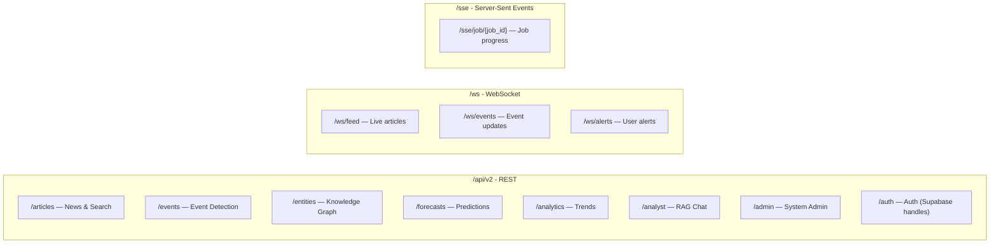
```mermaid
flowchart LR
    subgraph REST["/api/v2 - REST"]
        A1["/articles — News & Search"]
        A2["/events — Event Detection"]
        A3["/entities — Knowledge Graph"]
        A4["/forecasts — Predictions"]
        A5["/analytics — Trends"]
        A6["/analyst — RAG Chat"]
        A7["/admin — System Admin"]
        A8["/auth — Auth (Supabase handles)"]
    end

    subgraph WS["/ws - WebSocket"]
        W1["/ws/feed — Live articles"]
        W2["/ws/events — Event updates"]
        W3["/ws/alerts — User alerts"]
    end

    subgraph SSE["/sse - Server-Sent Events"]
        S1["/sse/job/{job_id} — Job progress"]
    end
```

### 16.2 Full Endpoint Catalog

```
ARTICLES
GET  /api/v2/articles                    Filter: source, region, risk_level, date_from, date_to, language
GET  /api/v2/articles/{id}               Full article with analysis, entities, event link
GET  /api/v2/articles/search             Body: {query, strategy: hybrid|vector|fts, filters, limit}
GET  /api/v2/articles/{id}/similar       Top-K similar articles by embedding
GET  /api/v2/articles/{id}/entities      Entities mentioned in article

EVENTS
GET  /api/v2/events                      Filter: status, risk_level, region, date_range
GET  /api/v2/events/{id}                 Event + constituent articles + timeline
GET  /api/v2/events/{id}/timeline        Time-ordered article progression
GET  /api/v2/events/active               Currently active High/Critical events

ENTITIES (Knowledge Graph)
GET  /api/v2/entities                    Filter: type, min_mentions
GET  /api/v2/entities/{id}               Entity with all relations and recent articles
GET  /api/v2/entities/{id}/graph         Subgraph: entity + N-hop neighbors (for D3)
GET  /api/v2/entities/{id}/timeline      Entity mention frequency over time
GET  /api/v2/entities/search             Semantic entity search via embeddings

FORECASTS
GET  /api/v2/forecasts                   Active, unexpired forecasts
GET  /api/v2/forecasts/{id}              Forecast + evidence articles + scenarios
POST /api/v2/forecasts/generate          Body: {event_id} → triggers forecasting agent
GET  /api/v2/forecasts/accuracy          Brier score, resolution stats

ANALYTICS
GET  /api/v2/analytics/sentiment-trend   {region, days} → time series
GET  /api/v2/analytics/risk-scores       Country risk scores → world map data
GET  /api/v2/analytics/top-entities      Most mentioned entities (last N days)
GET  /api/v2/analytics/event-frequency   Events per day/week by region
GET  /api/v2/analytics/source-breakdown  Article counts by source with bias ratings

AI ANALYST (RAG)
POST /api/v2/analyst/query               Body: {question, conversation_id?} → streamed answer
GET  /api/v2/analyst/history/{conv_id}   Conversation history
POST /api/v2/analyst/summarize           Body: {topic, days} → topic summary with sources

WATCHLISTS & ALERTS
GET  /api/v2/watchlists                  User's watchlists
POST /api/v2/watchlists                  Create watchlist
PUT  /api/v2/watchlists/{id}             Update watchlist
GET  /api/v2/alerts                      User's alerts (paginated)
PUT  /api/v2/alerts/{id}/read            Mark alert as read

ADMIN (restricted to admin role)
POST /api/v2/admin/ingest                Trigger immediate ingestion
GET  /api/v2/admin/jobs                  Celery job queue status
GET  /api/v2/admin/metrics               System health: DB size, queue depth, cache hit rate
DELETE /api/v2/admin/articles/{id}       Remove article (moderation)
GET  /api/v2/admin/model-usage           Groq token usage per day/model

WEBSOCKETS
WS   /ws/feed?token=jwt                  Real-time article stream
WS   /ws/events?token=jwt                Real-time event updates
WS   /ws/alerts?token=jwt                User-specific alert stream

SSE
GET  /sse/job/{job_id}                   Job progress stream (ingestion, clustering)
```

### 16.3 Response Design Principles

- All responses: `Content-Type: application/json`
- Pagination: cursor-based (not offset) for real-time feeds — `?cursor=<article_id>&limit=20`
- Errors: RFC 7807 Problem Details format
- Streaming (RAG): `text/event-stream` for token-by-token answer streaming
- Auth: `Authorization: Bearer <supabase_jwt>` on all non-public endpoints

```python
# app/core/response.py
from pydantic import BaseModel
from typing import Generic, TypeVar, Optional

T = TypeVar("T")

class PaginatedResponse(BaseModel, Generic[T]):
    items: list[T]
    next_cursor: Optional[str] = None
    total_count: Optional[int] = None  # Expensive, only when requested

class ErrorResponse(BaseModel):
    type: str       # URI: https://errors.platform.dev/not-found
    title: str      # "Article Not Found"
    status: int     # 404
    detail: str     # "Article with ID xyz does not exist"
    instance: str   # "/api/v2/articles/xyz"
```

---

## 17. Frontend Dashboard Architecture

### 17.1 Page Map

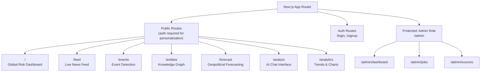
```mermaid
flowchart TD
    ROOT["Next.js App Router"]
    
    ROOT --> PUB["Public Routes\n(auth required for personalization)"]
    ROOT --> AUTH_ROUTE["Auth Routes\n/login, /signup"]
    
    PUB --> DASH["/\nGlobal Risk Dashboard"]
    PUB --> FEED["/feed\nLive News Feed"]
    PUB --> EVENTS["/events\nEvent Detection"]
    PUB --> ENTITIES["/entities\nKnowledge Graph"]
    PUB --> FORECAST["/forecast\nGeopolitical Forecasting"]
    PUB --> ANALYST["/analyst\nAI Chat Interface"]
    PUB --> ANALYTICS["/analytics\nTrends & Charts"]
    
    ROOT --> ADMIN_ROUTE["Protected: Admin Role\n/admin"]
    ADMIN_ROUTE --> ADMIN_DASH["/admin/dashboard"]
    ADMIN_ROUTE --> ADMIN_JOBS["/admin/jobs"]
    ADMIN_ROUTE --> ADMIN_SOURCES["/admin/sources"]
```

### 17.2 Dashboard Page Layout (`/`)

```
┌─────────────────────────────────────────────────────────────────────────────┐
│  HEADER: Logo | Nav: Feed / Events / Entities / Forecast / Analyst | Auth  │
├───────────────────────────────────────┬─────────────────────────────────────┤
│  🗺️ GLOBAL RISK MAP                   │  🔥 CRITICAL EVENTS (3)             │
│  D3.js Choropleth World Map           │  • Russia-Ukraine Ceasefire         │
│  Color: Low(green) → Critical(red)    │    🔴 Critical · 47 articles        │
│  Click country → filtered feed        │  • US-China Chip Sanctions          │
│  Data: /api/v2/analytics/risk-scores  │    🟠 High · 23 articles            │
│                                       │  • Iran Nuclear Talks               │
│                                       │    🟡 Medium · 12 articles          │
├───────────────┬───────────────────────┼────────────┬────────────────────────┤
│ 📊 SENTIMENT  │  🕸️ TOP ENTITIES       │ 🔮 LATEST  │  📰 LIVE FEED         │
│ TREND (7d)    │  (Most mentioned)      │ FORECAST   │  WebSocket stream      │
│ Recharts Area │  Putin • USA • NATO    │ Confidence │  Auto-scrolling        │
│ by region     │  Click → /entities/id  │ bar chart  │  New badge on update   │
├───────────────┴───────────────────────┴────────────┴────────────────────────┤
│  FOOTER: Last updated: 2m ago | Articles today: 1,234 | Events active: 8   │
└─────────────────────────────────────────────────────────────────────────────┘
```

### 17.3 Key Frontend Components

```typescript
// components/GlobalRiskMap.tsx
// D3.js choropleth — country colors driven by /api/v2/analytics/risk-scores
// Click on country → navigate to /feed?region=<country_code>

// components/LiveNewsFeed.tsx  
// Connects to /ws/feed WebSocket
// New articles prepended with animation
// Infinite scroll with cursor-based pagination

// components/EntityGraph.tsx
// D3.js force-directed graph
// Nodes: entities colored by type
// Edges: relations labeled with type
// Click node → side panel with entity details + recent articles

// components/AIAnalystChat.tsx
// Streaming responses via EventSource (SSE)
// Source citations rendered as clickable article cards below answer
// Conversation history stored in localStorage (no server session needed)

// components/ForecastCard.tsx
// Prediction text + confidence bar (Radix UI Progress)
// Key scenarios as accordion
// Evidence articles as expandable list
// Brier score if resolved
```

### 17.4 State Management

- **Server state**: TanStack Query (React Query) for all API calls — handles caching, refetching, optimistic updates
- **Real-time state**: Zustand store for WebSocket-pushed articles and alerts
- **Auth state**: Supabase client SDK handles JWT + session refresh automatically
- **UI state**: React `useState` — no global store for UI-only state

```typescript
// store/realtime.ts (Zustand)
interface RealtimeStore {
  liveArticles: Article[];
  activeAlerts: Alert[];
  addArticle: (article: Article) => void;
  markAlertRead: (id: string) => void;
}

export const useRealtimeStore = create<RealtimeStore>((set) => ({
  liveArticles: [],
  activeAlerts: [],
  addArticle: (article) => set((s) => ({
    liveArticles: [article, ...s.liveArticles].slice(0, 200) // Cap at 200
  })),
  markAlertRead: (id) => set((s) => ({
    activeAlerts: s.activeAlerts.map(a => a.id === id ? {...a, is_read: true} : a)
  }))
}));
```

---

## 18. Observability & Monitoring

### 18.1 Metrics Stack

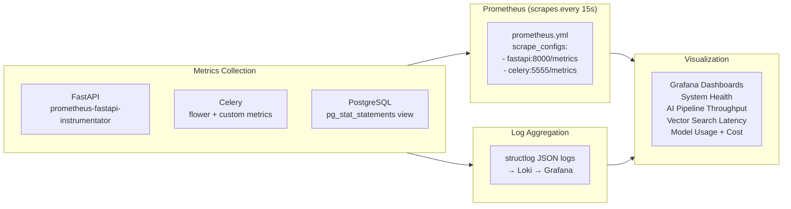
```mermaid
flowchart LR
    subgraph METRICS["Metrics Collection"]
        FA2["FastAPI\nprometheus-fastapi-instrumentator"]
        CELERY2["Celery\nflower + custom metrics"]
        PG2["PostgreSQL\npg_stat_statements view"]
    end

    subgraph PROM["Prometheus (scrapes every 15s)"]
        P["prometheus.yml\nscrape_configs:\n- fastapi:8000/metrics\n- celery:5555/metrics"]
    end

    subgraph VIZ["Visualization"]
        GF2["Grafana Dashboards\nSystem Health\nAI Pipeline Throughput\nVector Search Latency\nModel Usage + Cost"]
    end

    subgraph LOGS["Log Aggregation"]
        STR["structlog JSON logs\n→ Loki → Grafana"]
    end

    METRICS --> PROM --> VIZ
    METRICS --> LOGS --> VIZ
```

### 18.2 Custom Metrics to Track

```python
# app/core/metrics.py
from prometheus_client import Counter, Histogram, Gauge

# Article processing
articles_ingested_total = Counter("articles_ingested_total", "Total articles ingested", ["source"])
articles_processed_total = Counter("articles_processed_total", "Total articles AI-processed", ["status"])
processing_latency = Histogram("article_processing_seconds", "Article AI processing latency",
                               buckets=[0.5, 1.0, 2.0, 5.0, 10.0])

# AI Model usage
groq_tokens_used = Counter("groq_tokens_total", "Groq API tokens used", ["model", "task"])
groq_requests_total = Counter("groq_requests_total", "Groq API calls", ["model", "status"])
ollama_embedding_latency = Histogram("ollama_embedding_seconds", "Ollama embedding latency")

# Vector search
vector_search_latency = Histogram("vector_search_seconds", "pgvector query latency",
                                  buckets=[0.01, 0.05, 0.1, 0.25, 0.5])

# Events and clustering
events_detected_total = Counter("events_detected_total", "Events detected by clustering")
clustering_run_duration = Histogram("clustering_seconds", "HDBSCAN clustering duration")

# System health
db_connection_pool_size = Gauge("db_pool_size", "DB connection pool size")
redis_queue_depth = Gauge("celery_queue_depth", "Celery queue depth", ["queue_name"])
```

### 18.3 Structured Logging

```python
# app/core/logging.py
import structlog

structlog.configure(
    processors=[
        structlog.stdlib.add_log_level,
        structlog.stdlib.add_logger_name,
        structlog.processors.TimeStamper(fmt="iso"),
        structlog.processors.JSONRenderer(),  # JSON → Loki
    ],
    wrapper_class=structlog.make_filtering_bound_logger(logging.INFO),
)

# Usage — context-rich, queryable logs
logger = structlog.get_logger()
log = logger.bind(article_id="uuid-here", source="NewsAPI", user_id=None)
log.info("article_analysis_complete", 
         strategic_score=87.3, 
         risk_level="High",
         processing_ms=1240,
         model_used="llama-3.1-8b-instant")
```

### 18.4 Grafana Dashboard Panels

Design 4 dashboards:

1. **System Health**: API latency p50/p95/p99, error rate, DB connections, Redis queue depth
2. **AI Pipeline**: Articles/hour throughput, processing latency, failure rate by stage, Groq token spend
3. **Platform Intelligence**: Articles ingested by source, events detected per day, entity growth rate
4. **User Activity**: Active users, RAG queries/day, most-queried topics, forecast generation rate

---

## 19. Security Architecture

### 19.1 Auth Flow

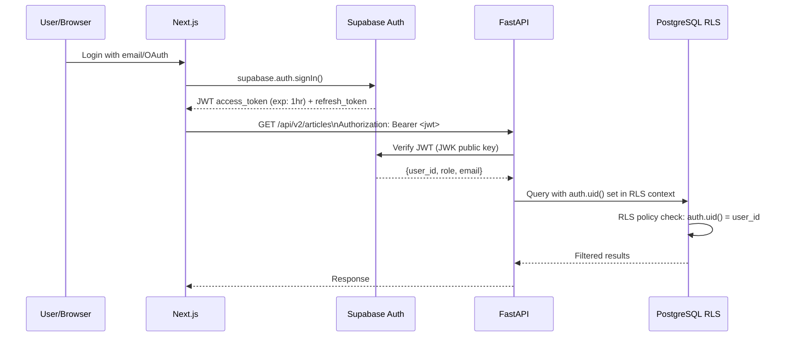
```mermaid
sequenceDiagram
    participant USER as User/Browser
    participant FE as Next.js
    participant SB as Supabase Auth
    participant API as FastAPI
    participant DB as PostgreSQL RLS

    USER->>FE: Login with email/OAuth
    FE->>SB: supabase.auth.signIn()
    SB-->>FE: JWT access_token (exp: 1hr) + refresh_token
    
    FE->>API: GET /api/v2/articles\nAuthorization: Bearer <jwt>
    API->>SB: Verify JWT (JWK public key)
    SB-->>API: {user_id, role, email}
    API->>DB: Query with auth.uid() set in RLS context
    DB->>DB: RLS policy check: auth.uid() = user_id
    DB-->>API: Filtered results
    API-->>FE: Response
```

### 19.2 Security Checklist

- Supabase JWT verified on every request (asymmetric RSA, not shared secret)
- Row-Level Security on all user-specific tables
- API keys for external services stored in environment variables, never in code
- Groq/Ollama calls never exposed directly to frontend — always proxied via backend
- Rate limiting: `slowapi` on FastAPI (100 req/min per user for REST, 10/min for RAG)
- CORS configured for frontend domain only
- All user inputs sanitized before embedding or LLM prompts (prompt injection prevention)
- `max_tokens` capped on all Groq calls to prevent runaway cost

```python
# Prompt injection defense — strip suspicious patterns
def sanitize_user_input(query: str) -> str:
    MAX_LENGTH = 500
    query = query[:MAX_LENGTH]
    # Remove common injection patterns
    blocked = ["ignore previous", "system:", "you are now", "disregard"]
    for pattern in blocked:
        if pattern.lower() in query.lower():
            raise HTTPException(400, "Invalid query content")
    return query.strip()
```

---

## 20. Deployment Architecture

### 20.1 Local Development (Docker Compose)

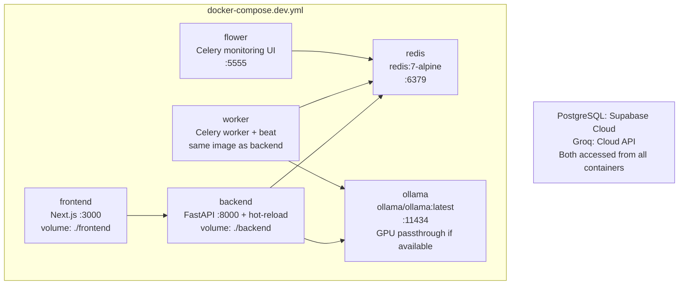
```mermaid
flowchart TB
    subgraph DOCKER["docker-compose.dev.yml"]
        FE_C["frontend\nNext.js :3000\nvolume: ./frontend"]
        API_C["backend\nFastAPI :8000 + hot-reload\nvolume: ./backend"]
        WORKER_C["worker\nCelery worker + beat\nsame image as backend"]
        REDIS_C["redis\nredis:7-alpine\n:6379"]
        OLLAMA_C["ollama\nollama/ollama:latest\n:11434\nGPU passthrough if available"]
        FLOWER_C["flower\nCelery monitoring UI\n:5555"]
    end
    
    FE_C --> API_C
    API_C --> REDIS_C
    API_C --> OLLAMA_C
    WORKER_C --> REDIS_C
    WORKER_C --> OLLAMA_C
    FLOWER_C --> REDIS_C
    
    NOTE["PostgreSQL: Supabase Cloud\nGroq: Cloud API\nBoth accessed from all containers"]
```

### 20.2 Production Architecture

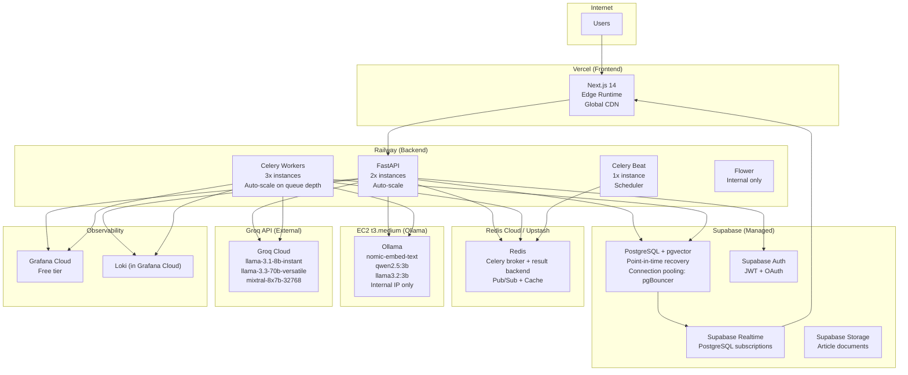
```mermaid
flowchart TB
    subgraph INTERNET["Internet"]
        USERS["Users"]
    end

    subgraph VERCEL["Vercel (Frontend)"]
        NX_PROD["Next.js 14\nEdge Runtime\nGlobal CDN"]
    end

    subgraph RAILWAY["Railway (Backend)"]
        API_PROD["FastAPI\n2x instances\nAuto-scale"]
        WORKER_PROD["Celery Workers\n3x instances\nAuto-scale on queue depth"]
        BEAT_PROD["Celery Beat\n1x instance\nScheduler"]
        FLOWER_PROD["Flower\nInternal only"]
    end

    subgraph SUPABASE["Supabase (Managed)"]
        PG_PROD["PostgreSQL + pgvector\nPoint-in-time recovery\nConnection pooling: pgBouncer"]
        AUTH_PROD["Supabase Auth\nJWT + OAuth"]
        RT_PROD["Supabase Realtime\nPostgreSQL subscriptions"]
        STOR_PROD["Supabase Storage\nArticle documents"]
    end

    subgraph REDIS_CLOUD["Redis Cloud / Upstash"]
        RD_PROD["Redis\nCelery broker + result backend\nPub/Sub + Cache"]
    end

    subgraph OLLAMA_CLOUD["EC2 t3.medium (Ollama)"]
        OL_PROD["Ollama\nnomic-embed-text\nqwen2.5:3b\nllama3.2:3b\nInternal IP only"]
    end

    subgraph GROQ_API["Groq API (External)"]
        GQ["Groq Cloud\nllama-3.1-8b-instant\nllama-3.3-70b-versatile\nmixtral-8x7b-32768"]
    end

    subgraph OBS_CLOUD["Observability"]
        GF_PROD["Grafana Cloud\nFree tier"]
        LK_PROD["Loki (in Grafana Cloud)"]
    end

    USERS --> NX_PROD
    NX_PROD --> API_PROD
    API_PROD --> PG_PROD & AUTH_PROD & RD_PROD & OL_PROD & GQ
    WORKER_PROD --> PG_PROD & RD_PROD & OL_PROD & GQ
    BEAT_PROD --> RD_PROD
    PG_PROD --> RT_PROD --> NX_PROD
    API_PROD & WORKER_PROD --> LK_PROD & GF_PROD
```

### 20.3 CI/CD Pipeline (GitHub Actions)

```yaml
# .github/workflows/deploy.yml
name: CI/CD Pipeline

on:
  push:
    branches: [main]
  pull_request:
    branches: [main]

jobs:
  lint-and-test:
    runs-on: ubuntu-latest
    steps:
      - uses: actions/checkout@v4
      - uses: actions/setup-python@v5
        with: { python-version: "3.11" }
      - run: pip install -r backend/requirements-dev.txt
      - run: ruff check backend/          # Linter (faster than flake8)
      - run: mypy backend/app/            # Type checking
      - run: pytest backend/tests/ -v --cov=backend/app --cov-fail-under=70

  frontend-check:
    runs-on: ubuntu-latest
    steps:
      - uses: actions/checkout@v4
      - uses: actions/setup-node@v4
        with: { node-version: "20" }
      - run: cd frontend && npm ci
      - run: cd frontend && npm run type-check
      - run: cd frontend && npm run lint
      - run: cd frontend && npm run build

  deploy-backend:
    needs: [lint-and-test]
    if: github.ref == 'refs/heads/main'
    runs-on: ubuntu-latest
    steps:
      - uses: actions/checkout@v4
      - uses: railway/deploy-action@v1   # Railway auto-deploys from git push too
        with:
          service: backend
          token: ${{ secrets.RAILWAY_TOKEN }}

  deploy-frontend:
    needs: [frontend-check]
    if: github.ref == 'refs/heads/main'
    runs-on: ubuntu-latest
    steps:
      - uses: actions/checkout@v4
      - uses: amondnet/vercel-action@v25
        with:
          vercel-token: ${{ secrets.VERCEL_TOKEN }}
          vercel-org-id: ${{ secrets.ORG_ID }}
          vercel-project-id: ${{ secrets.PROJECT_ID }}
          vercel-args: "--prod"
```

---

## 21. Development Roadmap

### 21.1 Milestone Overview

```mermaid
gantt
    title V2 Development Roadmap (~13 weeks)
    dateFormat  YYYY-MM-DD
    section Phase 1 · Foundation (2 wks)
    Monorepo + Docker Compose + CI skeleton  :p1a, 2025-01-06, 3d
    Supabase schema + pgvector + RLS         :p1b, after p1a, 4d
    FastAPI skeleton + Supabase Auth         :p1c, after p1b, 4d
    Multi-source news ingestion + dedup      :p1d, after p1c, 5d

    section Phase 2 · AI Core (3 wks)
    Redis Streams + Celery task queue        :p2a, after p1d, 4d
    Ollama integration + embedding pipeline  :p2b, after p2a, 5d
    Groq integration + analysis pipeline     :p2c, after p2b, 5d
    LLM-based strategic scorer               :p2d, after p2c, 3d

    section Phase 3 · Advanced AI (3 wks)
    Entity extraction agent (Ollama qwen)    :p3a, after p2d, 5d
    Event clustering - HDBSCAN              :p3b, after p3a, 7d
    Knowledge graph - entities + relations   :p3c, after p3b, 6d
    RAG system - hybrid retrieval            :p3d, after p2c, 7d
    Forecasting engine + Brier tracking      :p3e, after p3c, 5d

    section Phase 4 · Frontend (3 wks)
    Next.js + Shadcn + Supabase client       :p4a, after p1d, 4d
    Global risk map - D3 choropleth          :p4b, after p4a, 5d
    Live news feed - WebSocket               :p4c, after p4b, 5d
    Analytics dashboard - Recharts           :p4d, after p4c, 4d
    Knowledge graph explorer - D3 force      :p4e, after p3c, 5d
    AI Analyst chat - streaming RAG          :p4f, after p3d, 5d
    Forecasting dashboard                    :p4g, after p3e, 4d

    section Phase 5 · Production (2 wks)
    Prometheus + Grafana observability       :p5a, after p3e, 4d
    Alert system + watchlists                :p5b, after p5a, 3d
    Railway + Vercel deployment              :p5c, after p5b, 3d
    Performance tuning + load testing        :p5d, after p5c, 3d
    Documentation + demo video              :p5e, after p5d, 3d
```

### 21.2 Phase-by-Phase Deliverables

**Phase 1 (Foundation) — End state:** Can ingest news from 5+ sources, store in Supabase, deduplicate, log in. No AI yet.

**Phase 2 (AI Core) — End state:** Every ingested article gets sentiment, bias, LLM summary, strategic score, and embedding. Pipeline fully async via Celery.

**Phase 3 (Advanced AI) — End state:** Events auto-detected and clustered. Knowledge graph growing with each article. RAG Q&A working in terminal. Forecasts generating for High/Critical events.

**Phase 4 (Frontend) — End state:** Full Next.js dashboard. World map, live feed, entity graph, AI chat, forecasting view — all functional and visually impressive.

**Phase 5 (Production) — End state:** Deployed live. Grafana monitoring. Alerts working. Clean README with architecture diagrams and live demo link.

### 21.3 Weekly Sprint Breakdown

| Week | Focus | Key Deliverable |
|------|-------|-----------------|
| 1 | Infra setup | Docker Compose running, Supabase schema created, CI pipeline green |
| 2 | Ingestion | 5 news sources fetching, dedup working, articles in Supabase |
| 3 | AI Core 1 | Celery queue, Ollama embedding, Groq sentiment/bias |
| 4 | AI Core 2 | LLM scorer, translation, article summary — full analysis pipeline |
| 5 | Entity Agent | qwen2.5:3b extracting entities, relations stored in graph tables |
| 6 | Event Detection | HDBSCAN clustering, events created/updated, LLM event titles |
| 7 | RAG System | Hybrid retrieval, Groq generation, citations working in API |
| 8 | Forecasting | Forecasting agent, Brier score tracking, forecast API |
| 9 | Frontend 1 | Next.js setup, world risk map, news feed with live WebSocket |
| 10 | Frontend 2 | Entity graph (D3 force), analytics dashboard |
| 11 | Frontend 3 | AI Analyst chat (streaming), forecasting dashboard |
| 12 | Production | Observability, Railway/Vercel deployment, alerts + watchlists |
| 13 | Polish | README, demo video, performance tuning, test coverage ≥70% |

---

## 22. Feature Priority Matrix

### 22.1 Impact vs Effort Grid

```
HIGH IMPACT
    │
    │  [RAG Chat]      [World Risk Map]  [Event Clustering]
    │  High/Hard       High/Medium       High/Medium
    │
    │  [Live Feed]     [Entity Graph]    [Forecasting]
    │  High/Medium     High/Hard         High/Hard
    │
    │  [Supabase Auth] [Embedding Pipeline] [Groq Analysis]
    │  Med/Easy        Med/Easy             Med/Easy
    │
    │  [Alerts]        [Analytics]       [Brier Tracking]
    │  Med/Medium      Med/Easy          Low/Easy
    │
LOW IMPACT
    └──────────────────────────────────────────────────▶
         LOW EFFORT                             HIGH EFFORT
```

### 22.2 Priority Table

| Feature | Impact | Effort | Priority | Build in Phase |
|---------|--------|--------|----------|----------------|
| Supabase Auth + RLS | 🔴 High | 🟢 Low | **P0** | 1 |
| Multi-source ingestion | 🔴 High | 🟢 Low | **P0** | 1 |
| Groq sentiment + bias + summary | 🔴 High | 🟢 Low | **P0** | 2 |
| Embedding pipeline (pgvector) | 🔴 High | 🟢 Low | **P0** | 2 |
| Live news feed (WebSocket) | 🔴 High | 🟡 Medium | **P1** | 4 |
| Global risk map (D3) | 🔴 High | 🟡 Medium | **P1** | 4 |
| RAG AI Analyst Chat | 🔴 High | 🔴 High | **P1** | 4 |
| Event detection (HDBSCAN) | 🔴 High | 🟡 Medium | **P1** | 3 |
| Entity extraction agent | 🟡 Medium | 🟡 Medium | **P2** | 3 |
| Knowledge graph viewer (D3) | 🔴 High | 🔴 High | **P2** | 4 |
| Geopolitical forecasting | 🔴 High | 🔴 High | **P2** | 3 |
| Analytics dashboard | 🟡 Medium | 🟢 Low | **P2** | 4 |
| Observability (Prometheus + Grafana) | 🟡 Medium | 🟡 Medium | **P2** | 5 |
| Alerts + watchlists | 🟡 Medium | 🟡 Medium | **P3** | 5 |
| Brier score tracking | 🟢 Low | 🟢 Low | **P3** | 5 |
| Multi-language UI | 🟢 Low | 🔴 High | ❌ Skip | — |
| Neo4j graph DB | 🟢 Low | 🔴 High | ❌ Skip | — |
| Fine-tuned domain model | 🟡 Medium | 🔴 High | ❌ Skip v2 | — |

---

## 23. Evaluation Metrics per Subsystem

Show these in your README and portfolio — recruiters with ML background respect quantified results.

| Subsystem | Metric | Target | How to Measure |
|-----------|--------|--------|----------------|
| Ingestion | Articles/hour | ≥ 500 | Prometheus counter |
| Deduplication | False positive rate | < 1% | Manual audit of 100 random pairs |
| Sentiment analysis | F1 vs human labels | ≥ 0.80 | Label 50 articles manually, compare |
| Bias detection | Accuracy vs human | ≥ 0.75 | Label 50 articles manually, compare |
| Translation quality | BLEU score | ≥ 25 | Compare to Google Translate on 20 articles |
| Summarization | ROUGE-L | ≥ 0.35 | Compare LLM summary to article lead paragraph |
| Event clustering | Silhouette score | ≥ 0.5 | Scikit-learn on cluster assignments |
| RAG retrieval | Recall@5 | ≥ 0.75 | 20 test questions with known relevant articles |
| RAG end-to-end | Human eval | ≥ 4/5 stars | Rate 20 Q&A pairs |
| Forecasting | Brier Score | < 0.20 | Track over 30+ resolved forecasts |
| API latency | p95 response time | < 200ms | Prometheus histogram (excluding LLM calls) |
| LLM call latency | p95 Groq response | < 2s | Prometheus histogram |
| Embedding latency | Per-document | < 200ms | Ollama timing |

---

## 24. Portfolio & Resume Impact

### 24.1 How to Frame This Project for Each Role

**AI Engineer:**
> "Built a production AI platform with multi-model orchestration (Groq + Ollama), RAG pipeline using pgvector hybrid search, multi-agent processing with Celery, and LLM-based geopolitical forecasting with Brier score tracking. Routed tasks across 4 LLMs based on latency/cost/quality tradeoffs."

**ML Engineer:**
> "Designed an embedding pipeline ingesting 500+ articles/hour via nomic-embed-text into pgvector with HNSW indexing. Implemented HDBSCAN event clustering (silhouette: 0.58), hybrid retrieval with Reciprocal Rank Fusion, and evaluated all subsystems with standard NLP metrics (ROUGE, BLEU, F1, Brier Score)."

**Full Stack Engineer:**
> "Built end-to-end platform: Next.js 14 App Router + TypeScript frontend with D3.js force graph and WebSocket real-time feed, FastAPI backend with Celery async processing, Supabase PostgreSQL with Row-Level Security, deployed to Vercel + Railway with GitHub Actions CI/CD."

**Software Engineer:**
> "Designed scalable event-driven architecture: Redis Streams + Celery for async task queue, Supabase Realtime for live UI updates, cursor-based pagination, Prometheus + Grafana observability, Docker Compose local dev, 70%+ test coverage, and structured logging with structlog."

### 24.2 What to Show in the Demo (5-Minute Recruiter Demo Script)

1. **Open dashboard** (30s): Show world risk map, live article count, active events
2. **New article ingestion** (30s): Trigger ingestion, show article appear in feed in real-time
3. **Article detail** (30s): Click article — show sentiment, bias, strategic score, LLM summary, entities
4. **Knowledge graph** (45s): Navigate to /entities, show D3 force graph, click a node, show related entities and articles
5. **Event clustering** (30s): Navigate to /events, explain that these were auto-detected from semantic clustering
6. **AI Analyst chat** (90s): Ask "What's the current status of Russia-Ukraine negotiations?" — show streaming response with source citations
7. **Forecasting** (45s): Show an active forecast with confidence score, scenarios, evidence
8. **Grafana** (30s): Show Prometheus dashboard with pipeline throughput and Groq token usage

**Total: ~5 minutes. Visually impressive, technically dense, clearly differentiated from course projects.**

### 24.3 GitHub README Must-Haves

- Architecture diagram (the flowchart from Section 3 — embed as image)
- Live demo link (Vercel URL)
- Tech stack badges
- GIF/video of the dashboard in action
- Evaluation metrics table (Section 23)
- "How to run locally" in 5 commands (Docker Compose)
- Project structure with one-line descriptions per module
- Acknowledgement of Groq, Supabase, Ollama

### 24.4 Unique Features That Don't Exist in Standard Tutorials

These are the things that make interviewers ask "how did you build this?":

1. **HDBSCAN event detection** — Not a feature in any standard news dashboard tutorial
2. **Knowledge graph from LLM extraction** — Entity/relation extraction + D3 force graph is rare in student projects
3. **Brier score tracked forecasting** — Shows ML evaluation discipline beyond classification metrics
4. **Hybrid retrieval (RRF)** — Most RAG tutorials use single-strategy retrieval; RRF shows systems thinking
5. **Multi-model routing with cost budgeting** — Shows production engineering mindset
6. **Supabase RLS for multi-tenancy** — Shows security-first architecture

### 24.5 Interview Talking Points

Be ready to explain any of these deeply:

- "Why HDBSCAN over K-means for event detection?" → K-means requires k upfront; HDBSCAN discovers arbitrary-shaped clusters; handles noise; no need to know number of events in advance
- "Why pgvector over Pinecone?" → No separate service; join vectors with metadata in SQL; sufficient for < 1M vectors; lower operational complexity for a solo project
- "Why Reciprocal Rank Fusion?" → Simple, parameter-free method to combine ranked lists; no training data needed; outperforms weighted sum empirically
- "Why Groq over OpenAI?" → 10x faster at inference (400-700 tok/s vs 40-60 tok/s); free tier generous; irrelevant model quality difference for classification/summarization tasks
- "How do you prevent prompt injection in the RAG system?" → Input sanitization, max_length cap, blocked phrase detection, all user input treated as untrusted

---

## Appendix A: Monorepo Directory Structure

```
geopolitical-platform/
├── .github/
│   └── workflows/
│       ├── ci.yml
│       └── deploy.yml
├── backend/
│   ├── app/
│   │   ├── agents/          # Celery task agents
│   │   │   ├── analysis_agent.py
│   │   │   ├── embedding_agent.py
│   │   │   ├── entity_agent.py
│   │   │   ├── clustering_agent.py
│   │   │   ├── kg_agent.py
│   │   │   ├── forecasting_agent.py
│   │   │   └── alert_agent.py
│   │   ├── ai/              # AI client wrappers
│   │   │   ├── groq_client.py
│   │   │   ├── ollama_client.py
│   │   │   └── model_router.py
│   │   ├── api/             # FastAPI routers
│   │   │   ├── articles.py
│   │   │   ├── events.py
│   │   │   ├── entities.py
│   │   │   ├── forecasts.py
│   │   │   ├── analytics.py
│   │   │   ├── analyst.py   # RAG endpoints
│   │   │   ├── watchlists.py
│   │   │   ├── admin.py
│   │   │   └── websockets.py
│   │   ├── core/
│   │   │   ├── celery_app.py
│   │   │   ├── config.py    # Pydantic Settings
│   │   │   ├── database.py
│   │   │   ├── metrics.py
│   │   │   ├── logging.py
│   │   │   └── security.py
│   │   ├── db/
│   │   │   ├── repositories/ # One repo per domain entity
│   │   │   │   ├── article_repo.py
│   │   │   │   ├── event_repo.py
│   │   │   │   ├── entity_repo.py
│   │   │   │   └── forecast_repo.py
│   │   │   └── migrations/  # Alembic migrations
│   │   ├── ingestion/
│   │   │   ├── base.py      # Abstract adapter
│   │   │   ├── adapters/
│   │   │   │   ├── newsapi.py
│   │   │   │   ├── gnews.py
│   │   │   │   ├── gdelt.py
│   │   │   │   ├── rss.py
│   │   │   │   └── mediastack.py
│   │   │   ├── coordinator.py
│   │   │   └── deduplicator.py
│   │   ├── rag/
│   │   │   ├── indexer.py
│   │   │   ├── retriever.py  # Hybrid search
│   │   │   └── query_engine.py
│   │   └── main.py
│   ├── tests/
│   │   ├── unit/
│   │   ├── integration/
│   │   └── conftest.py
│   ├── Dockerfile
│   └── requirements.txt
├── frontend/
│   ├── app/                  # Next.js App Router
│   │   ├── page.tsx          # Dashboard
│   │   ├── feed/page.tsx
│   │   ├── events/page.tsx
│   │   ├── entities/page.tsx
│   │   ├── forecast/page.tsx
│   │   ├── analyst/page.tsx
│   │   └── analytics/page.tsx
│   ├── components/
│   │   ├── maps/
│   │   │   └── GlobalRiskMap.tsx
│   │   ├── feed/
│   │   │   └── LiveNewsFeed.tsx
│   │   ├── entities/
│   │   │   └── EntityGraph.tsx
│   │   ├── analyst/
│   │   │   └── AIAnalystChat.tsx
│   │   └── ui/              # Shadcn components
│   ├── lib/
│   │   ├── api.ts            # API client
│   │   ├── supabase.ts
│   │   └── websocket.ts
│   ├── store/
│   │   └── realtime.ts       # Zustand
│   └── package.json
├── docker-compose.yml
├── docker-compose.dev.yml
└── README.md
```

---

## Appendix B: Environment Variables

```env
# backend/.env

# Supabase
SUPABASE_URL=https://xxx.supabase.co
SUPABASE_ANON_KEY=...
SUPABASE_SERVICE_ROLE_KEY=...   # Backend only, never expose to frontend
DATABASE_URL=postgresql://...

# Groq
GROQ_API_KEY=gsk_...
GROQ_DAILY_TOKEN_BUDGET=500000

# Ollama
OLLAMA_BASE_URL=http://ollama:11434   # Docker internal

# Redis
REDIS_URL=redis://redis:6379/0

# News APIs
NEWSAPI_KEY=...
GNEWS_KEY=...
MEDIASTACK_KEY=...
GDELT_ENABLED=true              # No key needed for GDELT

# Security
JWT_SECRET=...                  # For internal service tokens (not Supabase JWT)
CORS_ORIGINS=https://yourapp.vercel.app,http://localhost:3000

# Observability
PROMETHEUS_ENABLED=true
LOG_LEVEL=INFO
SENTRY_DSN=...                  # Optional: Sentry for error tracking

# App
ENVIRONMENT=production          # development | production
INGESTION_INTERVAL_MINUTES=15
CLUSTERING_INTERVAL_MINUTES=30
```

---

*Blueprint version: 2.0.0 | Last updated: 2025 | Target: Production-grade AI Portfolio Project*
